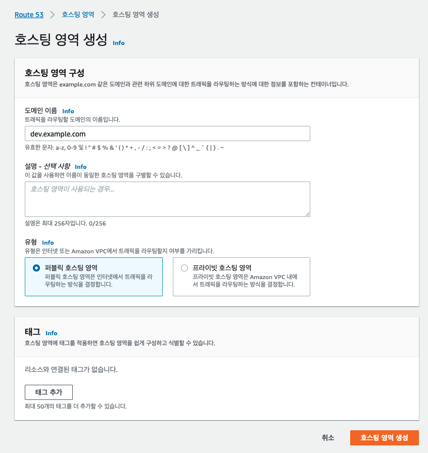
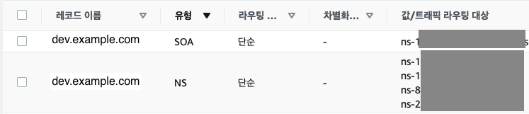
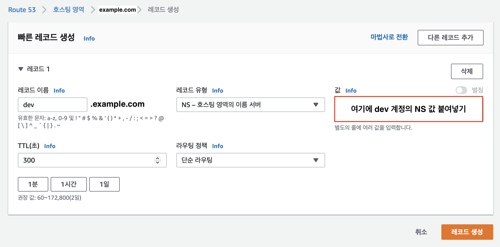
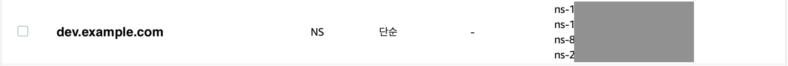

# AWS 계정들끼리 Route 53 도메인 공유
> 참고 : https://serverless-stack.com/chapters/share-route-53-domains-across-aws-accounts.html

### 목표
- prod 계정에 `example.com` 도메인이 있음
- dev 계정에 `example.com`의 하위 도메인인 `dev.example.com` 도메인을 추가하고자 함

### 1. dev 계정으로 로그인하여 Route53의 호스팅 영역 생성
  - 이때 하위 도메인함(dev.example.com)으로 호스팅 영역을 생성

### 2. 도메인 생성 후 자동으로 NS, SOA 레코드 생성됨

### 3. 생성된 하위 도메인의 NS 레코드 값을 복사
### 4. prod 계정으로 로그인하여 Route53의 호스팅 영역에 들어가서 레코드 값 추가

### 5. 레코드 이름에는 하위 도메인, 값에는 dev 계정의 NS 값을 붙여넣음

