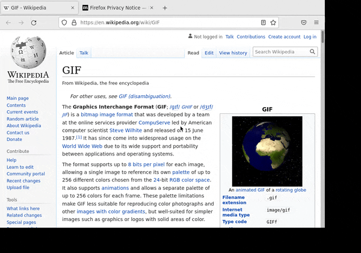

# Docker Ubuntu 내에서 브라우저 화면 녹화하기
Recording Firefox Browser Using xvfb, ffmpeg on Ubuntu 18.04 Docker Image


### How to
Download files and run the commands below on your local terminal
```shell script
$ docker build --tag browser-record .
$ docker run -d --name browser-record browser-record (Don't remove -d option)
into the container,
$ sh /recording/record.sh or sh record.sh
```

### Get file to your local
Run the command on your local terminal
```
$ docker cp browser-record:/recording/output/. /yourLocalPath
```

### Source
##### Dockerfile
```dockerfile
FROM ubuntu:18.04

RUN /usr/bin/apt-get update && \
        /usr/bin/apt-get install -y curl && \
        /usr/bin/apt-get update && \
        /usr/bin/apt-get upgrade -y && \
        /usr/bin/apt-get install -y firefox xvfb ffmpeg

COPY init.sh /usr/local/bin/
RUN chmod u+x /usr/local/bin/init.sh

WORKDIR /recording
COPY record.sh /recording/record.sh
RUN chmod +x /recording/record.sh
RUN mkdir /recording/output

ENV DISPLAY :99

ENTRYPOINT ["record.sh"]
```

##### record.sh
```shell script
#!/bin/bash

echo "run browser(firefox) on virtual frame"
/usr/bin/xvfb-run --listen-tcp --server-num ${DISPLAY} --auth-file /tmp/xvfb.auth -s "-ac -screen 0 1028x720x24" firefox https://en.wikipedia.org/wiki/GIF &

echo "record 30 seconds using ffmpeg (if you want no time limit, remove `-t 30` option)"
/usr/bin/ffmpeg -video_size 1028x720 -framerate 30 -f x11grab -i :99 -t 30 -codec:v libx264 /recording/output/output.mp4
```

### TODO
- Optimize Frame Size
