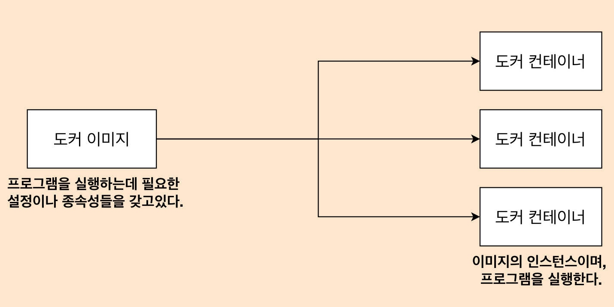
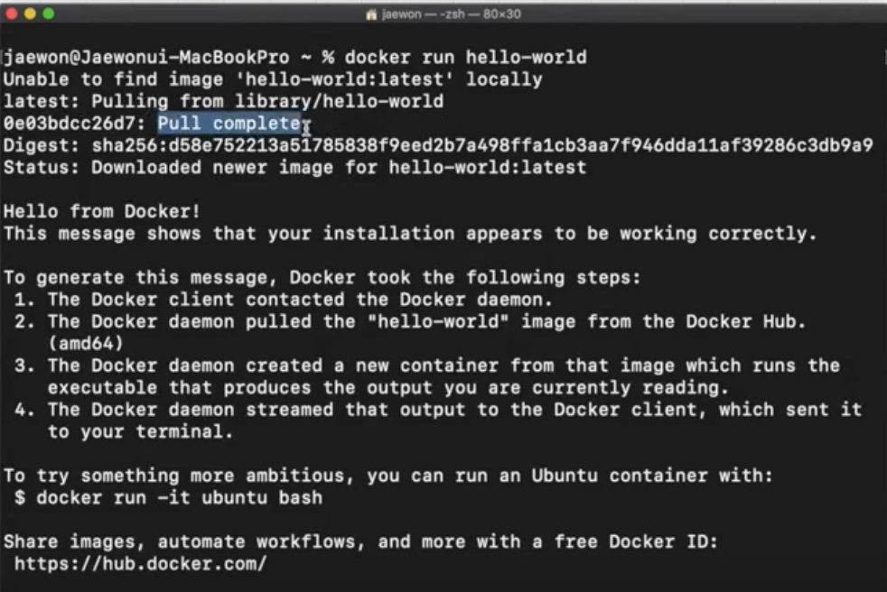
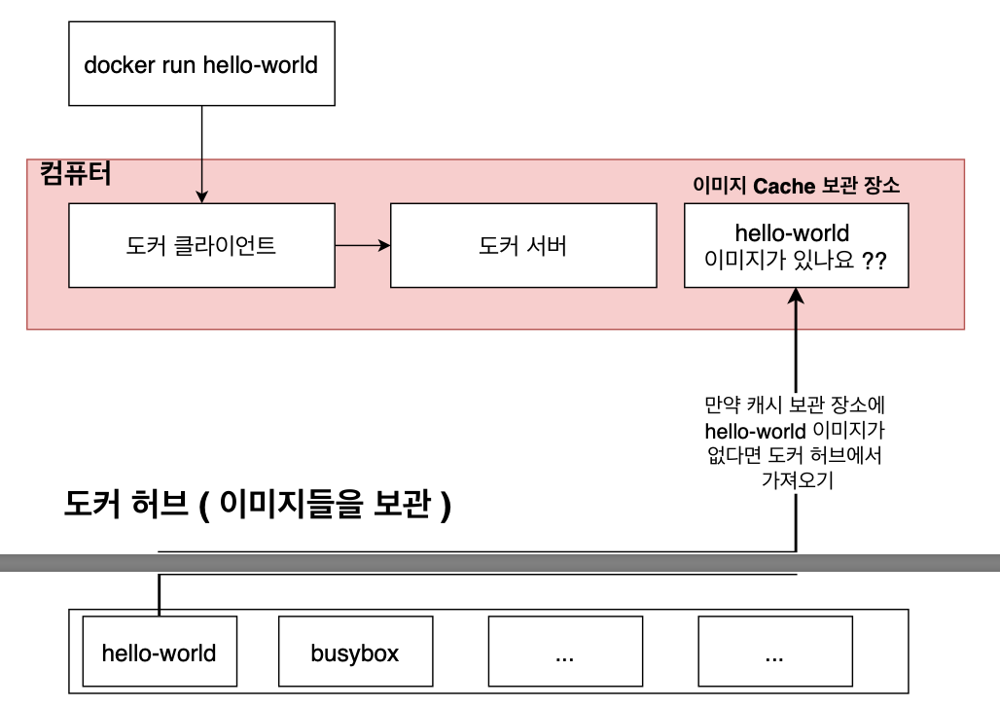
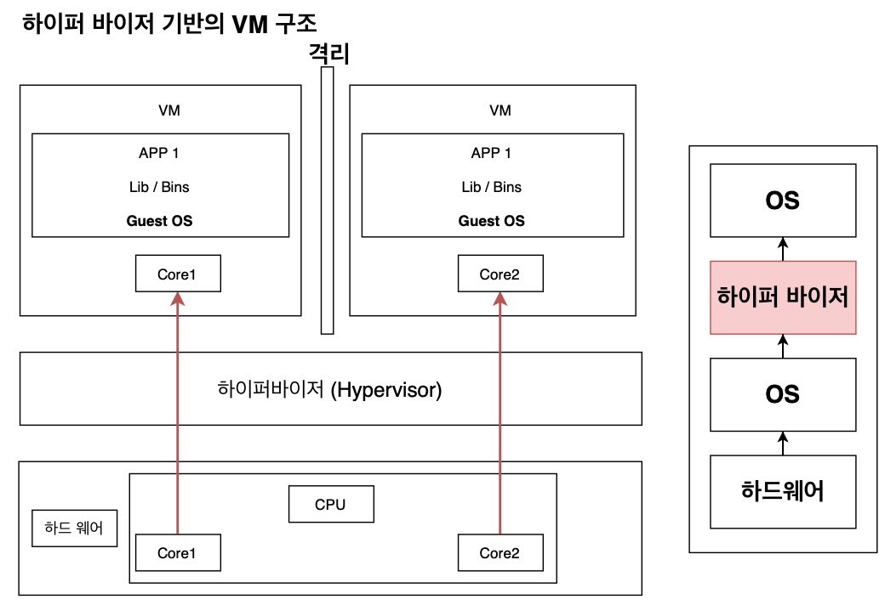
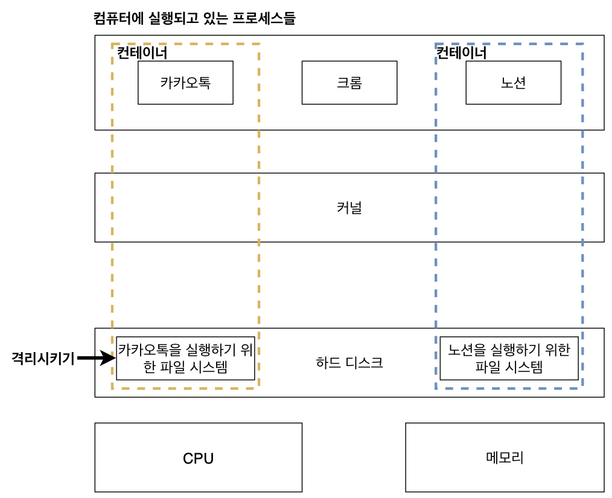
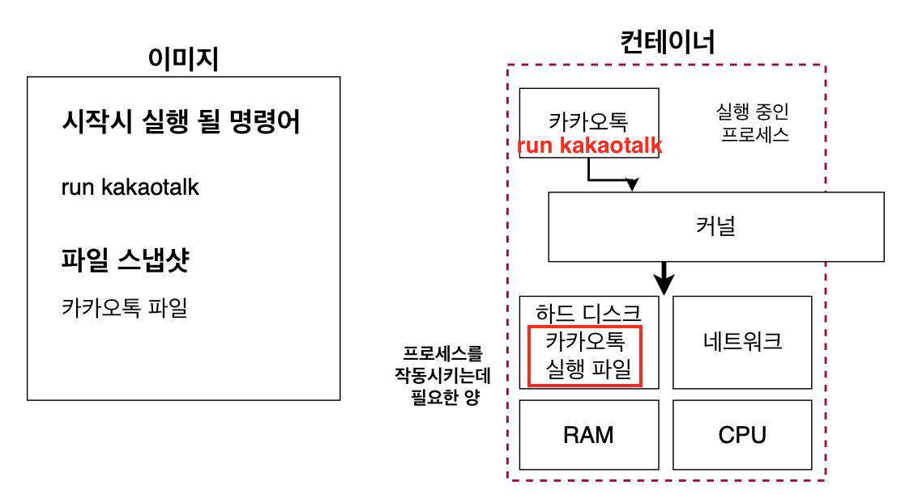
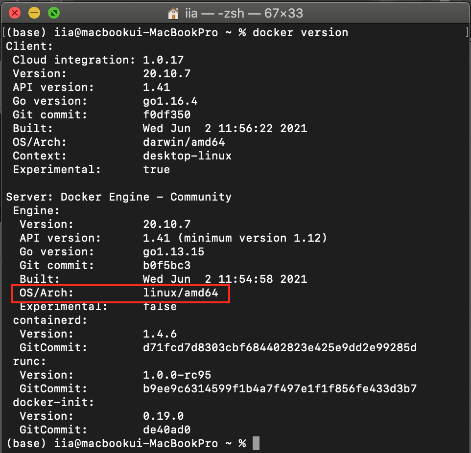
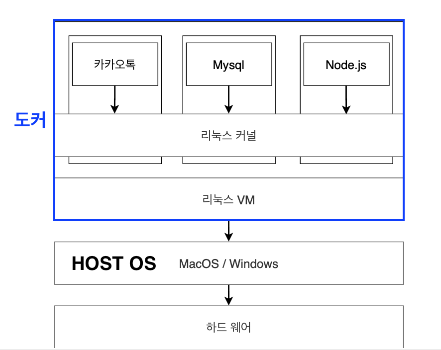

# 1. 도커 기본
> 인프런 강의 [따라하며 배우는 도커와 CI환경](https://www.inflearn.com/course/%EB%94%B0%EB%9D%BC%ED%95%98%EB%A9%B0-%EB%B0%B0%EC%9A%B0%EB%8A%94-%EB%8F%84%EC%BB%A4-ci) 를 듣고 내용을 정리하였습니다.

### 도커를 쓰는 이유
- 최근에는 많은 곳에서 도커를 사용하고 있음
- 어떤 프로그램을 다운받는 과정을 굉장히 간단하게 만듬
- 설치 과정에서의 예상치 못한 에러도 덜 발생함

### 도커란 무엇인가?
- `컨테이너`를 사용하여 프로그램을 더 쉽게 만들고 배포하고 실행할 수 있게 하는 도구.  컨테이너 기반의 오픈소스 가상화 플랫폼이며 생태계
- 서버에서의 `컨테이너`? 다양한 프로그램, 실행환경을 컨테이너로 추상화하고 동일한 인터페이스를 제공하여 프로그램 배포 및 관리를 단순화함

### 도커 이미지와 도커 컨테이너 정리
- `이미지` : 응용 프로그램을 실행하는 데 필요한 모든 것(코드, 런타임, 시스템 도구, 라이브러리 및 설정 등)을 포함하는 가볍고 독립적이며 실행가능한 소프트웨어 패키지
- `컨테이너` : 이미지의 인스턴스로 볼 수 있으며, 소프트웨어를 환경으로부터 격리시키고 개발과 스테이징의 차이에도 불구하고 균일하게 작동하도록 보장함
- 이미지는 런타임에 컨테이너가 되고, 컨테이너의 경우 도커 엔진에서 실행될 때 이미지가 컨테이너가 됨

### 도커를 사용할 때의 흐름
- 터미널에서 `docker run hello-world` 실행
- 
- 내 이미지 캐시 보관장소에 존재하지 않는 이미지를 실행했기 때문에 `unable to find image ~` 문구가 나옴
- 도커 허브에서 해당 이미지를 찾아봄
- 허브에 이미지가 존재하면 Pulling 
- 위 과정을 이미지로 표현하면 아래와 같음
- 

### 도커와 기존의 가상화 기술의 차이를 통한 컨테이너 이해
##### 하이퍼바이저 기반의 가상화 출현
- 그 전에는 한 대의 서버를 하나의 용도로만 사용, 남는 서버 공간은 그대로 방치했음
- 하이버바이처가 출현하면서 논리적으로 공간을 분할하여 VM이라는 독립적인 가상 환경의 서버 이용 가능해짐
- 호스트 시스템에서 다수의 게스트 OS를 구동할수 있게 하는 소프트웨어, 그리고 하드웨어를 가상화하면서 하드웨어와 각각의 VM을 모니터링하는 중간 관리자
- 하이퍼바이저에 의해 구동되는 VM은 각 VM마다 독립된 가상 하드웨어 자원을 할당받음. 논리적으로 분리되어 있어서 한 VM에 오류가 발생해도 다른 VM으로 퍼지지 않는다는 장점이 있음
- 

##### 하이퍼 바이저는 크게 두 종류
- 네이티브 하이퍼 바이저 : 하드웨어를 직접 제어하기에 자원을 효율적으로 사용 가능하며, 별도의 호스트 OS가 없어 오버헤드가 적다. 하지만 여러 하드웨어 드라이버를 세팅해야해서 설치가 어려움
- 호스트형 하이퍼 바이저 (주로 사용) : 일반적인 소프트웨어처럼 호스트 OS 위에서 실행되며, 하드웨어 자원을 VM 내부의 게스트 OS에 에뮬레이트하는 방식으로 오버헤드가 큼. 하지만 게스트 OS 종류에 대한 제약이 없고 구현이 다소 쉬움.

##### 도커와 기존 가상화 기술(VM) 비교
도커는 가상화 기술(VM)에서 발전되어 나온 컨테이너 가상화 기술임
- 공통점
    - 기본 하드웨어에서 격리된 환경 내에 어플리케이션을 배치함
- 차이점
    - VM과 비교했을 때 컨테이너는 하이퍼바이저와 게스트 OS가 필요하지 않으므로 더 가벼움
    - 컨테이너 방식에서는 어플리케이션 실행 시 호스트 OS 위에 어플리케이션 실행 패키지인 이미지를 배포하기만 하면 되는데, VM은 어플리케이션 실행을 위해 VM을 띄우고 자원을 할당한 다음 게스트 OS를 부팅하여 어플리케이션을 실행해야하기 때문에 훨씬 복잡하고 무겁게 실행됨

- 가상머신(VM) : VM과 함께 내부에서 실행되는 모든 것은 호스트 운영 체제 또는 하이퍼바이저와 독립되어 있음. 가상 머신 플랫폼은 특정 VM에 대한 가상화 프로세스를 관리하기 위해 프로세스를 시작하고, 호스트 시스템은 자신의 하드웨어 자원의 일부를 VM에게 할당함. 그러나 VM과 근본적으로 다른 것은 시작 시간에 이 VM 환경을 위해 새롭고 이 특정 VM만을 위한 커널을 부팅하고 용량이 큰 운영체제 프로세스 세트를 시작한다는 것임. 이것은 응용 프로그램만 포함하는 일반적인 컨테이너보다 VM의 크기를 훨씬 크게 만듬 (OS까지 가상화하니까). 이런 방법은 비교적 사용법이 간단할 수 있지만 굉장히 느림
- 도커 컨테이너 : 돌아가는 어플리케이션은 컨테이너가 제공하는 격리 기능 내부에 샌드박스가 있지만, 여전히 같은 호스트의 다른 컨테이너와 동일한 커널을 공유함. 결과적으로 컨테이너 내부에서 실행되는 프로세스는 호스트 시스템에서 볼 수 있음. 예를 들어 도커와 함께 몽고DB 컨테이너를 시작하면 호스트의 터미널에서 ps-e grep 몽고를 실행하면 프로세스가 표시됨. 또한 컨테이너가 전체 OS를 내장할 필요가 없기 때문에 그것들은 매우 가볍고 일반적으로 5-100 MB임
    - 

##### 어떻게 도커 컨테이너를 격리할까?
먼저 리눅스에서 쓰이는 `C Group(control group)`과 `네임스페이스(namepspace)`를 알아야함. 이것들은 컨테이너와 호스트에서 실행되는 다른 프로세스 사이에 벽을 만드는 리눅스 커널 기능들임
- `C Group` : CPU, 메모리, Network Bandwith, HD I/O 등 프로세스 그룹의 시스템 리소스 사용량을 관리 => 어떤 어플이 사용량이 너무 많으면 그 어플리케이션을 C group에 집어 넣어서 CPU와 메모리 사용 제한 가능
- `namespace` : 하나의 시스템에서 프로세스를 격리시킬 수 있는 가상화 기술. 별개의 독립된 공간을 사용하는 것처럼 격리된 환경을 제공하는 경량 프로세스 가상화 기술

### 이미지로 컨테이너 만들기
도커 이미지는 프로그램을 실행하는 데 필요한 설정이나 종속성들(필요한 모든 것)을 갖고 포함하고 있어야 함. 그렇다면 필요한 것은 무엇일까?

1. 컨테이너 시작 시 실행될 명령어 
    - ex) `run kakaotalk`
2. 파일 스냅샷
    - ex) 카카오톡 파일(카카오톡을실행하는데 필요한 파일) 스냅샷. (스냅샷은 디렉토리나 파일을 카피한 것)

##### 이미지로 컨테이너 만드는 순서

1. Docker 클라이언트에 `docker run <이미지명>` 입력
2. 도커 이미지에 있는 파일 스냅샷을 컨테이터 하드 디스크에 옮겨줌
3. 이미지에서 가지고 있는 명령어를 이용해 카카오톡을 실행시켜줌

### C-group, 네임스페이스를 도커 환경에서 쓸 수 있는 이유
컨테이너를 격리시킬 수 있는 이유는 `C group`과 `네임스페이스`를 이용했기 때문임
하지만 생각해보면 `C group`과 `네임스페이스`는 리눅스 환경에서 사용되는 것인데, 맥 OS나 윈도우에서 어떻게 사용할까?

`docker version` 을 쳐보니 도커 클라이언트와 서버의 OS가 리눅스로 되어있는 걸 볼 수 있음
우리의 컴퓨터(호스트 OS)는 MacOS, Windows지만 도커 컨테이너 내부에는 리눅스 VM이 설치되어 있다.
그래서 우리 HOST OS와 별개로 도커 클라이언트와 도커 서버는 리눅스 환경에서 돌아가고 있음. 

