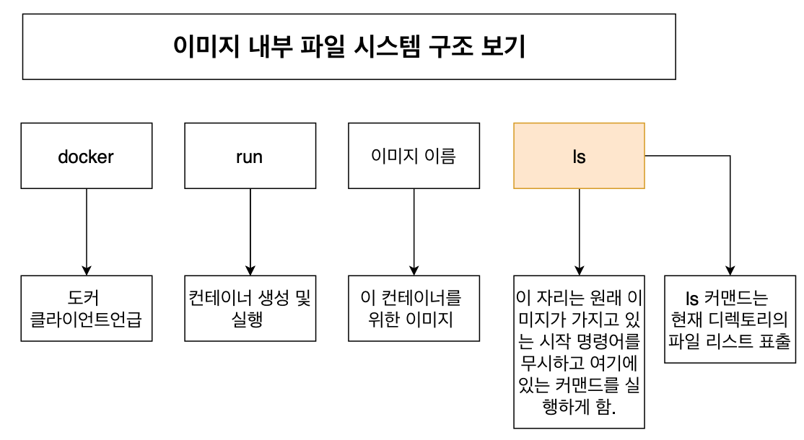
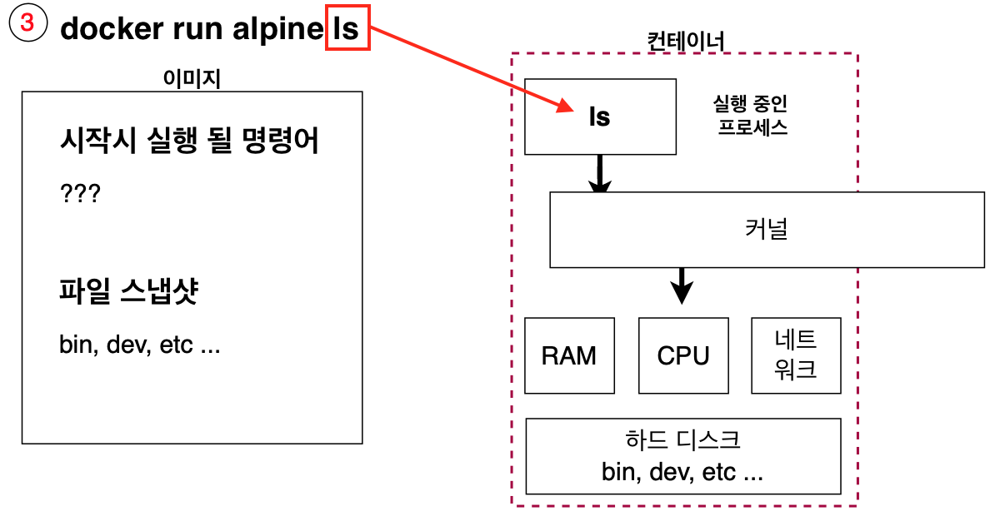
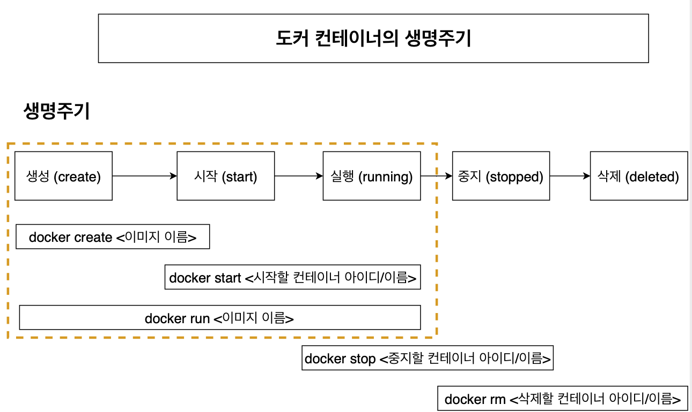
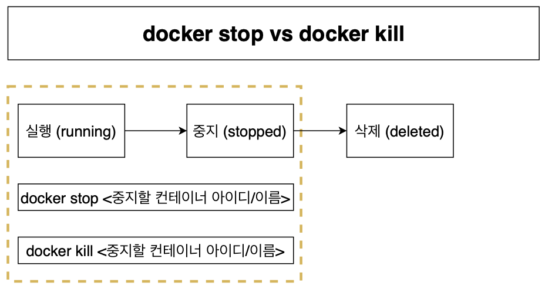
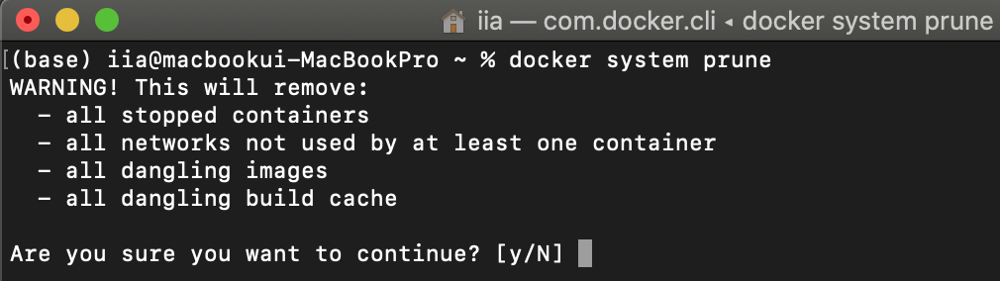
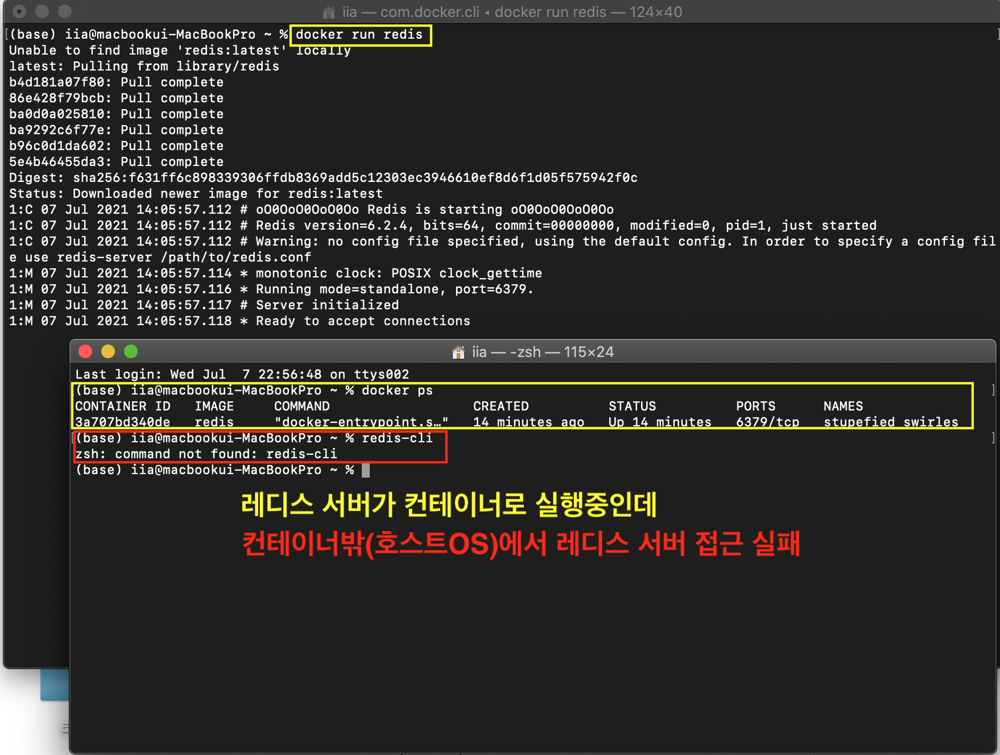
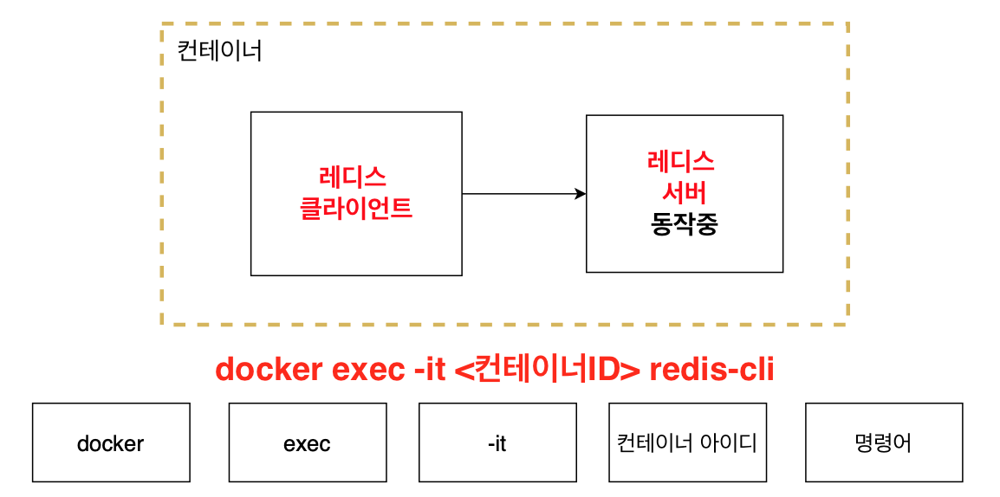
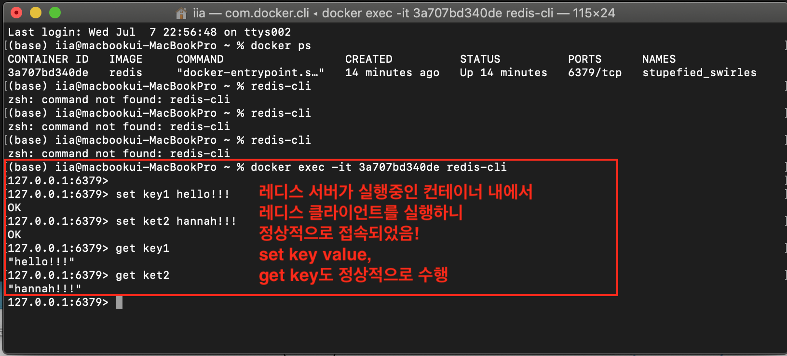

# 2. 기본적인 도커 클라이언트 명령어 알아보기
> 인프런 강의 [따라하며 배우는 도커와 CI환경](https://www.inflearn.com/course/%EB%94%B0%EB%9D%BC%ED%95%98%EB%A9%B0-%EB%B0%B0%EC%9A%B0%EB%8A%94-%EB%8F%84%EC%BB%A4-ci) 를 듣고 내용을 정리하였습니다.

### 도커 이미지 내부 파일 구조 보기
- `docker run image-name 네번째명령어` : 4번째 명령어는 원래 이미지가 가지고 있는 시작 명령어(`docker run image-name`)를 무시하고 여기에 있는 커맨드를 실행하라는 뜻
    - `docker run alpine ls` 명령어를 수행하면 컨테이너를 띄우지 않고 alpine 이미지 내부의 디렉토리의 파일 리스트가 표출됨
    - 
- 하지만 `docker run hello-world ls` 수행하면 에러 메시지가 발생함
    - 왜냐면 hello-world 이미지는 굉장히 컴팩트한 이미지라 `ls` 명령어를 처리할 수 있는 파일들이 하드디스크(파일스냅샷) 내에 존재하지 않음
    - 이미지 내 파일 스냅샷(하드 디스크에 들어감)에 따라서 사용할 수 있는 명령어가 있다는 걸 명심
    - 
 
### 컨테이너들 나열하기
##### docker ps
- 실행중인 컨테이너 나열 : `docker ps`
    - CONTAINER ID : 컨테이너의 고유한 아이디 해쉬값. 실제로는 길지만 일부만 표출
    - IMAGE : 컨테이너 생성 시 사용한 도커 이미지
    - COMMAND : 컨테이너 시작 시 실행될 명령어. 대부분 내장되어 있으므로 별도 설정 필요 X
    - CREATED : 컨테이너가 생성된 시간
    - STATUS : 컨테이너의 상태. 실행중은 UP, 종료는 Exited, 일시정지는 Pause
    - PORTS : 컨테이너가 개방한 포트와 호스트에 연결한 포트. 특별한 설정을 하지 않은 경우 출력되지 않음. 보통 설정함!
    - NAMES : 컨테이너의 고유한 이름. 컨테이너 생성시 `--name` 옵션으로 이름을 설정하지 않으면 도커 엔진이 임의로 형용사와 명사를 조합해 설정. ID와 마찬가지로 중복이 안되고 docker rename 명령어로 이름 변경 가능. `docker rename original-name changed-name`
- 원하는 항목만 보기 : `docker ps --format 'table{{.Names}}\ttable{{.Image}}'`
    - 원하는 Names, Image 항목만 볼 수 있음
    - 중간에 `\t`은 보기 좋게 띄워 보려고 넣음
- 꺼져있는 컨테이너도 모두 확인하기 : `docker ps -a`
- `docker run image-name ping localhost` : 또 다른 터미널로 `docker ps`를 수행하면 ping 날리는 컨테이너가 실행되고 있는 걸 볼 수 있음

### 도커 컨테이너의 생명 주기
##### 컨테이너


- 생성(create) : `docker create <이미지이름>` 이미지 내 파일스냅샷을 하드 디스크에 넣음. 생성된 컨테이너의 ID가 리턴됨
- 시작(start -a) : ` docker start <컨테이너ID/이름>` 이미지 내 시작 시 실행될 명령어를 컨테이너 내에서 커널에 수행
    - `-a` : attach. 도커 컨테이너가 실행되면서 나오는 output들을 화면(콘솔)에 출력해주는 기능
- 실행(running) : ` docker run <컨테이너ID/이름>` 피일스냅샷을 옮기고 명령어를 실행함 (create + start 합침)
- 중지(stopped) : `docker stop <컨테이너ID/이름>`, `docker kill <컨테이너ID/이름>` 두 가지 방법으로 컨테이너를 중지할 수 있음
    - stop : Gracefully 중지. 그 동안 수행중인 작업들을 완료하고 컨테이너를 중지시킴. `docker stop -> SIGTERM -> (정리하는시간) -> SIGKILL -> Container Main Process Kill`
    - kill : 즉시 중지. 어떤 것도 기다리지 않고 바로 컨테이너를 중지시킴 `docker kill -> SIGKILL -> Container Main Process Kill`
- 삭제(delete) : `docker rm <컨테이너ID/이름>`
    - 실행중인 컨테이너는 삭제가 불가하므로 먼저 중지해야함
    - 모든 컨테이너를 삭제하고 싶다면 ```docker rm `docker ps -a -q` ```
##### 이미지와 네트워크
- 이미지를 삭제하고 싶으면 : `docker rmi <이미지ID>`
- 한번에 컨테이너, 이미지, 네트워크 모두 삭제하고 싶으면 : `docker system prune`
    - 도커를 쓰지 않을 때 모두 정리하는 용도로 사용하면 좋음. 도커를 많이 쓰다보면 용량이 너무 많이 차지하니까!
    - 하지만 이것도 실행중인 컨테이너를 삭제할 수 없음
    - 
    
### 실행 중인 컨테이너에 명령어 전달
- 실행중인 컨테이너에 명령어 전달 : `docker exec <컨테이너ID> 명령어`
- `docker run <이미지이름> 명령어`와 동일한 결과를 냄
- 차이점은 새로운 컨테이너를 만들어서 명령어를 전달하느냐, 이미 실행중인 컨테이너에 명령어를 전달하느냐 정도!
  
### 레디스를 이용한 컨테이너 이해
- 레디스(Redis)는 In-memory 기반의 프로세스로 존재하는 "키-값" 구조의 데이터 관리 시스템임
- 레디스는 클라이언트와 서버 구조로 되어있음! 우선 도커로 레디스 서버를 실행시키겠음
    - `docker run redis`
- 이제 레디스 클라이언트를 통해 레디스 서버로 접근해볼까?
    - 호스트OS(내컴)의 터미널에서 `redis-cli` 명령어 실행
    - 레디스 클라이언트가 컨테이너 내에 작동하고 있는 레디스 서버를 실행하려고 함
    -     
- 레디스 클라이언트도 컨테이너 안에서 실행시켜야함!
    - `docker exec -it <레디스서버-컨테이너ID> redis-cli`
    - 
    - it : 인터렉티브, 터미널 : 이걸 붙여줘야 명렁어를 실행한 후 계속 명령어를 보낼 수 있음. 이거 안붙이면 컨테이너 밖으로 바로 나옴
    - 
    - 레디스 서버가 존재하는 컨테이너 내에서 레디스 클라이언트를 실행시키니 정상 접속되었음!
    
### 실행 중인 컨테이너에서 터미널 생활 즐기기
- 실행중인 컨테이너에 명령어를 전달할 때 마다 `docker exec -it <컨테이너ID> 명령어`로 매번 입력해줘야했음
- 이러한 번거로움을 해결하기 위해 컨테이너 안에 쉘이나 터미널 환경으로 접속 가능함
- 마지막 명령어를 `sh`로 주면 됨 => `docker exec -it <컨테이너ID> sh`
- 내부 터미널 환경에서  빠져나오려면 `control + D` 