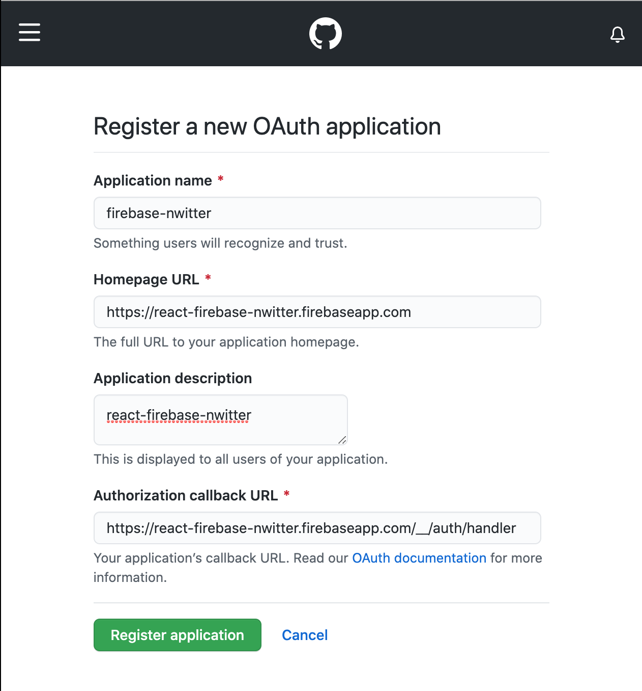
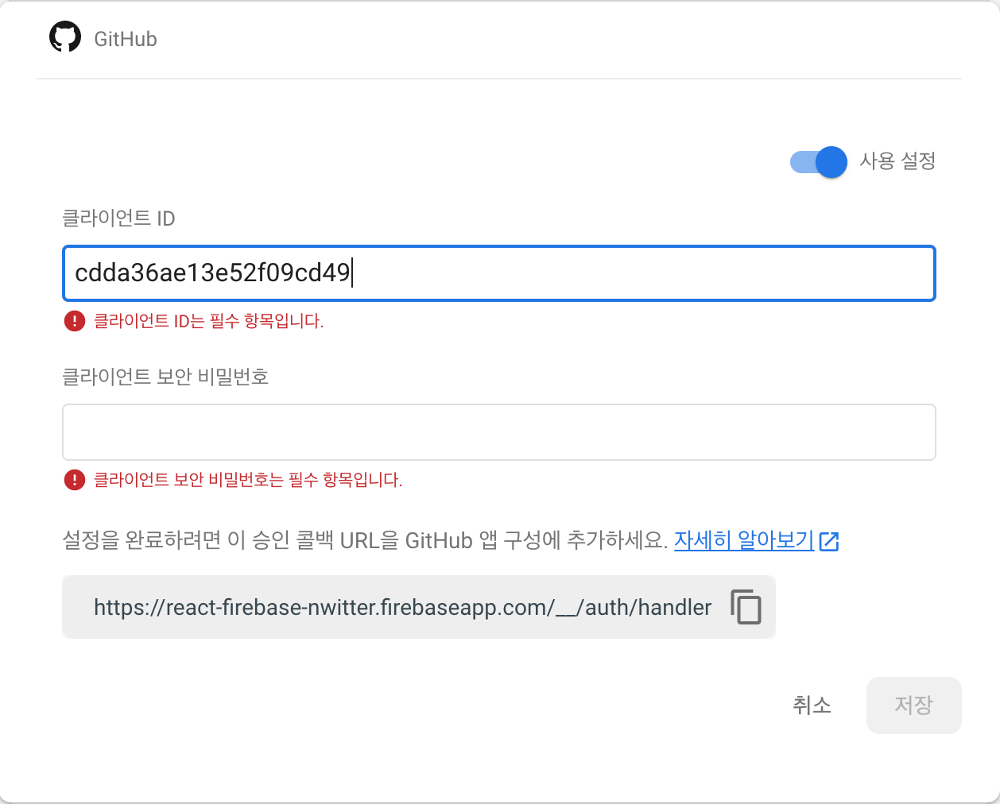
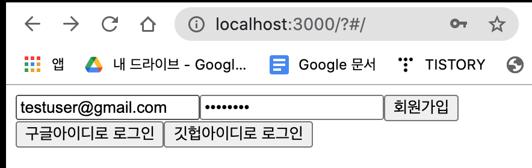
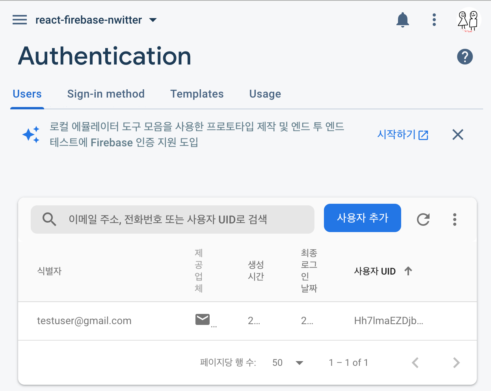

# Firebase Authentication
todo : Firebase Auth 추가 설명
 
Google Firebase에서는 사용자 계정 생성 방식을 다양하게 제공한다. 그 중 이메일, Google, Github 로그인 방식을 선택하여 실습 진행하였다.
이 과정에서 유용했던 공식문서나 팁이 있다면 정리하겠다. 이미 Firebase 프로젝트 생성 및 SDK 등록이 되어있다고 가정하겠다.

대부분의 출처는 [노마드코더 강의](https://nomadcoders.co/nwitter) 와 [Firebase 공식문서](https://firebase.google.com/docs/auth/?authuser=0) 임을 밝힌다.

[샘플코드는 Github에 올려두었다](https://github.com/HyunAh-iia/react-firebase-nwitter/commit/0a77b969b2159cae946886b421b1947653e6b84b)

# Firebase 계정 생성 및 로그인 방법 선택
- Firebase Authentication - `Sign-in method` 메뉴에서 계정 생성 방식 선택
- [참고] Github 같은 경우 OAuth 토큰을 발급받아야해서 아래와 같이 진행

### [참고] Firebase Github 로그인을 위한 OAuth 발급
1. Firebase Authentication - `Sign-in method`에서 Github 선택 후 `callback url` 복사
2. Github 로그인 후 Settings - Developer settings - `OAuth` 추가 선택
3. Firebase 프로젝트에서 복사한 `callback url` 등록
    
4. Github Oauth 토큰 발급 후 클라이언트 ID와 시크릿 키를 Firebase Github 로그인 연동 설정창에 입력
    

# Firebase 로그인
- [Firebase 공식문서 - 이메일/패스워드 기반 계정 생성](https://firebase.google.com/docs/auth/web/password-auth?hl=ko)
    - 가입 : createUserWithEmailAndPassword
    - 로그인 : signInWithEmailAndPassword
    - 로그아웃 : signOut
- [Firebase 공식문서 - Auth persistence(인증 상태 지속성)](https://firebase.google.com/docs/auth/web/auth-state-persistence)
    - 로그인한 사용자를 어떻게 기억할 것인지 선택
    - local(default) : 브라우저를 닫더라도 사용자를 기억 (웹과 리액트 앱에서는 Default로 선택)
    - session : 브라우저 탭이 열려있는 동안만 기억
    - none : 기억하지 않음. 탭을 새로고침 시 재로그인 필요
    
- 회원가입 결과 확인하기 (Github 샘플코드를 올려두었다)
    - 이메일/패스워드 입력 후 회원가입 버튼 클릭
     
    - Firebase 프로젝트에 접속해 `Authentication - Users`에 보면 회원이 등록된 것을 확인할 수 있음
    
