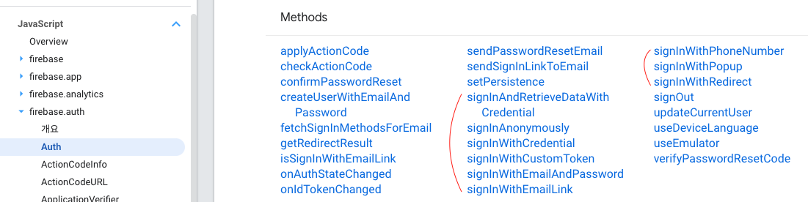
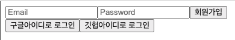
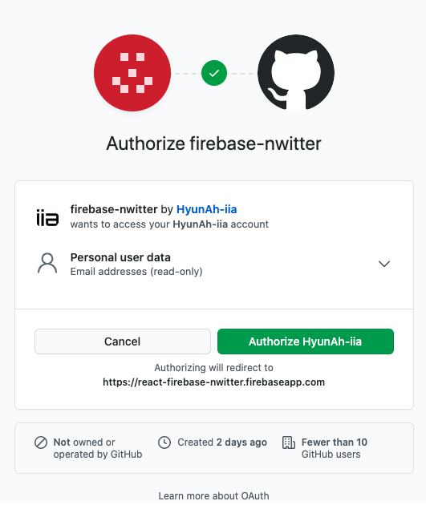
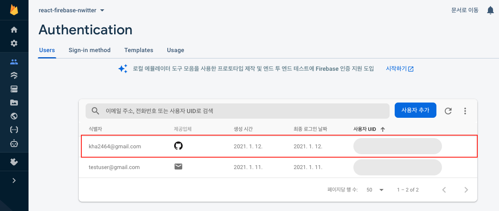

# Firebase Authentication
Google Firebase는 사용자 인증 시 필요한 백엔드 서비스와 인증 UI를 제공한다.
사용자 로그인 처리 시 Firebase UI를 통한 인증도 있고, SDK를 사용해 하나 이상의 로그인을 제공해주는 방법이 있다. 

>대부분의 출처는 [노마드코더 강의](https://nomadcoders.co/nwitter) 와 [Firebase 공식문서](https://firebase.google.com/docs/auth/?authuser=0) 임을 밝힌다.
 [샘플코드](https://github.com/HyunAh-iia/react-firebase-nwitter) 는 Github에 올려두었다
 
- 인증 방식
   - 이메일/비밀번호 기반
   - 익명
   - 제휴 공급업체(Google, Facebook, Twitter, Github) 통합
   - 전화번호 인증
   - 커스텀 인증 시스템 통합

- 작동 원리
   - 사용자에게 앱에 로그인 하기 위해 인증 정보를 요청 (이메일/패스워드 혹은 Google/Facebook 등 제휴업체 로그인 방식)
   - Firebase는 우리를 대신해 사용자에게 전달받은 정보로 이메일/비밀번호 인증 혹은 제휴 ID 공급업체로 받은 OAuth 토큰을 통해 인증함
   - 이 인증 정보를 우리가 서비스에 삽입한 Firebase 인증 SDK에 전달함
   - 우리는 이 인증 정보를 확인하여 클라이언트에 적절한 응답을 반환함

- 참고
   - 로그인이 정상적으로 수행된 경우 사용자 기본 프로필에 접근할 수 있고, 다른 Firebase 서비스에 저장된 데이터에 접근 권한 제어 가능
   - 인증을 마친 사용자는 기본적으로 Firebase 실시간 데이터베이스와 Cloud Storage에서 데이터를 읽고 쓸 수 있음

다양한 사용자 계정 생성 방식 중 이메일, Google, Github 로그인 방식을 선택하여 실습 진행하였다.
이 과정에서 유용했던 공식문서나 팁이 있다면 정리하겠다. 

이미 Firebase 프로젝트 생성 및 서비스에 SDK 등록이 되어있다고 가정하겠다. 자세한 내용은 [자바스크립트 프로젝트에 Firebase 추가](https://firebase.google.com/docs/web/setup?hl=ko) 를 참고하길 바란다. 

Firebase 계정 생성 및 로그인 방법 선택
---
- Firebase Authentication - `Sign-in method` 메뉴에서 계정 생성 방식 선택
- [참고] Github 같은 경우 OAuth 토큰을 발급받아야해서 아래와 같이 진행

### [참고] Firebase Github 로그인을 위한 OAuth 발급
1. Firebase Authentication - `Sign-in method`에서 Github 선택 후 `callback url` 복사
2. Github 로그인 후 Settings - Developer settings - `OAuth` 추가 선택
3. Firebase 프로젝트에서 복사한 `callback url` 등록
    
4. Github Oauth 토큰 발급 후 클라이언트 ID와 시크릿 키를 Firebase Github 로그인 연동 설정창에 입력
    

Firebase 로그인
---
[Firebase 로그인 방법 샘플코드](https://github.com/HyunAh-iia/react-firebase-nwitter/commit/0a77b969b2159cae946886b421b1947653e6b84b)

### 이메일/패스워드 기반의 계정 생성 및 로그인
- [Firebase 공식문서 - 이메일/패스워드 기반 계정 생성](https://firebase.google.com/docs/auth/web/password-auth?hl=ko)
    - 가입 : createUserWithEmailAndPassword
    - 로그인 : signInWithEmailAndPassword
    - 로그아웃 : signOut
- [Firebase 공식문서 - Auth persistence(인증 상태 지속성)](https://firebase.google.com/docs/auth/web/auth-state-persistence)
    - 로그인한 사용자를 어떻게 기억할 것인지 선택
    - local(default) : 브라우저를 닫더라도 사용자를 기억 (웹과 리액트 앱에서는 Default로 선택)
    - session : 브라우저 탭이 열려있는 동안만 기억
    - none : 기억하지 않음. 탭을 새로고침 시 재로그인 필요
    
- 회원가입 결과 확인하기 (Github 샘플코드를 올려두었다)
    - 이메일/패스워드 입력 후 회원가입 버튼 클릭
      
    - Firebase 프로젝트에 접속해 `Authentication - Users`에 보면 회원이 등록된 것을 확인할 수 있음
      
 

### 로그인 상태 추적을 위한 관찰자 Listener 등록 (auth().onAuthStateChanged)
아래 React 코드는 Application이 시작되면 `authService.currentUser`를 통해 로그인되어 있는 사용자가 존재하는 지 판단한다. 하지만 이 경우 Firebase가 초기화되기 전에 수행되므로 항상 로그아웃 된 상태라고 판단하게 된다.
코드를 직접 수행해본 결과를 보여주겠다.
```jsx
import React, {useState} from 'react';
import Router from "components/Router";
import {authService} from "myFirebase"

function App() {
  const [isLoggedIn, setIsLoggedIn] = useState(authService.currentUser);
  console.log(authService.currentUser); // null

  setInterval(() => {
    console.log(authService.currentUser) // user obejct
  }, 2000);

  return <Router isLoggedIn={isLoggedIn} />;
}

export default App;
```
콘솔로 출력해보면, application이 시작된 시점에는 `authService.currentUser`이 `null`이라는 것을 알 수 있다. 하지만 `setInterval(...)` 함수로 약 2 초의 시간이 지난 뒤에는 `authService.currentUser`에 로그인한 사용자 정보가 출력된다.


[Firebase 공식문서 - 현재 로그인한 사용자 가져오기](https://firebase.google.com/docs/auth/web/manage-users?hl=ko) 에서는 아래와 같은 가이드를 제공한다.
> 참고: auth 객체의 초기화가 완료되지 않아 currentUser가 null일 수도 있습니다. 관찰자를 사용해 사용자의 로그인 상태를 추적하면 이런 상황을 처리할 필요가 없습니다.

Firebase에서 권장하는 방식은 아래와 같이 Auth 개체에 관찰자를 설정하는 것이다.
```jsx
firebase.auth().onAuthStateChanged(function(user) {
  if (user) {
    // User is signed in.
  } else {
    // No user is signed in.
  }
});
```

- onAuthStateChanged
  - 사용자의 로그인 상태의 변화를 관찰하는 firebase event listener
  - firebase 초기화, 로그아웃, 계정 생성, 로그인 때에도 트리거 발생

코드를 수정해보자.
```jsx
import React, {useState, useEffect} from 'react';
import Router from "components/Router";
import {authService} from "myFirebase";

function App() {
    const [init, setInit] = useState(false);
    const [isLoggedIn, setIsLoggedIn] = useState(false);

    useEffect(() => {
        authService.onAuthStateChanged((user) => {
            console.log(user);
            if (user) {
                setIsLoggedIn(true);
            } else {
                setIsLoggedIn(false);
            }
            setInit(true);
        });
    }, []);

    return <>
        {init ? <Router isLoggedIn={isLoggedIn}/> : "initializing..."}
    </>;
}

export default App;
```
여기까지 하면 기본적인 회원가입, 로그인이 구현된다.

### 소셜 로그인
로그인하는 API에 대해서는 firebase.auth에서 `signIn*` 으로 시작하는 메서드를 보면 알 수 있다.
제휴 공급업체 로그인(소셜로그인)을 위해 `signInWithPopup`과 `signInWithRedirect`이 있는데, 비교적 간단한 Popup 방식을 선택하였다.  

`signInWithPopup`에 대한 설명은 [공식문서](https://firebase.google.com/docs/reference/js/firebase.auth.Auth?hl=ko#signinwithpopup) 를 참고하자.

[샘플코드](https://github.com/HyunAh-iia/react-firebase-nwitter/commits?author=HyunAh-iia&since=2020-12-31&until=2021-01-12) 는 깃헙에 올려두었다.

1. 공식문서의 안내대로 깃헙 로그인을 해보자.

2. 아래와 같이 팝업이 뜨면서 깃헙 로그인 페이지로 이동한다.

3. 깃헙 로그인 후에는 사용자 프로필에 접근 가능해지며, Firebase 프로젝트에서 Github을 통해 가입한 사용자가 등록된다. 
 


### 로그아웃
auth의 [signout 메서드](https://firebase.google.com/docs/reference/js/firebase.auth.Auth?hl=ko#signout) 를 활용하여 로그아웃한
[샘플코드](https://github.com/HyunAh-iia/react-firebase-nwitter/commit/f459a0eb32bb81e8c618293a93436860642a80e9) 

firebase.User
---
사용자 계정 관련하여 프로필 정보 조회, 수정, 삭제, 토큰, 이메일 인증, 비밀번호 변경, 인증방식 등등을 관리할 수 있다.
자세한 기능은 [firebase.user 공식문서](https://firebase.google.com/docs/reference/js/firebase.User) 를 참고하자.
기본적으로 Firebase에서 제공하는 사용자 프로필 정보는 `displayName`와 `photoURL`밖에 없다. 부가적인 정보를 더 담고 싶은 경우 별도의 컬렉션을 만들어 관리하면 된다. 
혹여 이메일을 바꾸고 싶은 경우에는 `verifyBeforeUpdateEmail`이나 `sendEmailVerification`와 같은 메서드를 활용하면 된다.

### 사용자 프로필 변경
```javascript
const user = firebase.auth().currentUser;
 
user.updateProfile({
  displayName: "Jane Q. User",
  photoURL: "https://example.com/jane-q-user/profile.jpg"
}).then(function() {
  var displayName = user.displayName;
  var photoURL = user.photoURL;
}, function(error) {
  // An error happened.
});
```
