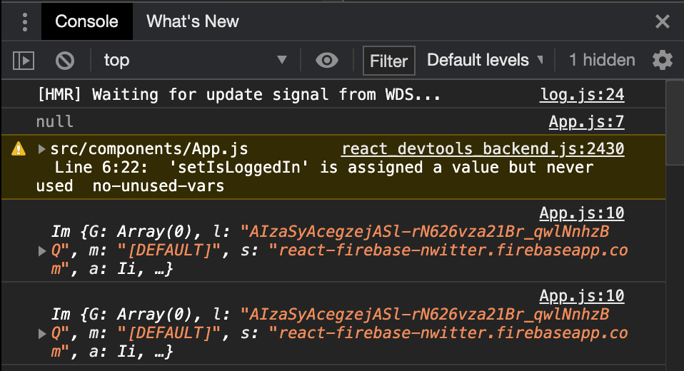

# Firebase Authentication
Google Firebase에서는 사용자 계정 생성 방식을 다양하게 제공한다. 그 중 이메일, Google, Github 로그인 방식을 선택하여 실습 진행하였다.
이 과정에서 유용했던 공식문서나 팁이 있다면 정리하겠다. 이미 Firebase 프로젝트 생성 및 SDK 등록이 되어있다고 가정하겠다.

대부분의 출처는 [노마드코더 강의](https://nomadcoders.co/nwitter) 와 [Firebase 공식문서](https://firebase.google.com/docs/auth/?authuser=0) 임을 밝힌다.
[샘플코드는 Github에 올려두었다](https://github.com/HyunAh-iia/react-firebase-nwitter)

--- 

# Firebase 계정 생성 및 로그인 방법 선택
- Firebase Authentication - `Sign-in method` 메뉴에서 계정 생성 방식 선택
- [참고] Github 같은 경우 OAuth 토큰을 발급받아야해서 아래와 같이 진행

### [참고] Firebase Github 로그인을 위한 OAuth 발급
1. Firebase Authentication - `Sign-in method`에서 Github 선택 후 `callback url` 복사
2. Github 로그인 후 Settings - Developer settings - `OAuth` 추가 선택
3. Firebase 프로젝트에서 복사한 `callback url` 등록
    
4. Github Oauth 토큰 발급 후 클라이언트 ID와 시크릿 키를 Firebase Github 로그인 연동 설정창에 입력
    

--- 

# Firebase 로그인
[Firebase 로그인 방법 샘플코드](https://github.com/HyunAh-iia/react-firebase-nwitter/commit/0a77b969b2159cae946886b421b1947653e6b84b)

### 이메일/패스워드 기반의 계정 생성 및 로그인
- [Firebase 공식문서 - 이메일/패스워드 기반 계정 생성](https://firebase.google.com/docs/auth/web/password-auth?hl=ko)
    - 가입 : createUserWithEmailAndPassword
    - 로그인 : signInWithEmailAndPassword
    - 로그아웃 : signOut
- [Firebase 공식문서 - Auth persistence(인증 상태 지속성)](https://firebase.google.com/docs/auth/web/auth-state-persistence)
    - 로그인한 사용자를 어떻게 기억할 것인지 선택
    - local(default) : 브라우저를 닫더라도 사용자를 기억 (웹과 리액트 앱에서는 Default로 선택)
    - session : 브라우저 탭이 열려있는 동안만 기억
    - none : 기억하지 않음. 탭을 새로고침 시 재로그인 필요
    
- 회원가입 결과 확인하기 (Github 샘플코드를 올려두었다)
    - 이메일/패스워드 입력 후 회원가입 버튼 클릭
     
    - Firebase 프로젝트에 접속해 `Authentication - Users`에 보면 회원이 등록된 것을 확인할 수 있음
    

### 로그인 상태 추적을 위한 관찰자 Listener 등록 (auth().onAuthStateChanged)
아래 React 코드는 Application이 시작되면 `authService.currentUser`를 통해 로그인되어 있는 사용자가 존재하는 지 판단한다. 하지만 이 경우 Firebase가 초기화되기 전에 수행되므로 항상 로그아웃 된 상태라고 판단하게 된다.
코드를 직접 수행해본 결과를 보여주겠다.
```jsx
import React, {useState} from 'react';
import Router from "components/Router";
import {authService} from "myFirebase"

function App() {
  const [isLoggedIn, setIsLoggedIn] = useState(authService.currentUser);
  console.log(authService.currentUser); // null

  setInterval(() => {
    console.log(authService.currentUser) // user obejct
  }, 2000);

  return <Router isLoggedIn={isLoggedIn} />;
}

export default App;
```
콘솔로 출력해보면, application이 시작된 시점에는 `authService.currentUser`이 `null`이라는 것을 알 수 있다. 하지만 `setInterval(...)` 함수로 약 2 초의 시간이 지난 뒤에는 `authService.currentUser`에 로그인한 사용자 정보가 출력된다.


[Firebase 공식문서 - 현재 로그인한 사용자 가져오기](https://firebase.google.com/docs/auth/web/manage-users?hl=ko) 에서는 아래와 같은 가이드를 제공한다.
> 참고: auth 객체의 초기화가 완료되지 않아 currentUser가 null일 수도 있습니다. 관찰자를 사용해 사용자의 로그인 상태를 추적하면 이런 상황을 처리할 필요가 없습니다.

Firebase에서 권장하는 방식은 아래와 같이 Auth 개체에 관찰자를 설정하는 것이다.
```jsx
firebase.auth().onAuthStateChanged(function(user) {
  if (user) {
    // User is signed in.
  } else {
    // No user is signed in.
  }
});
```

- onAuthStateChanged
  - 사용자의 로그인 상태의 변화를 관찰하는 firebase event listener
  - firebase 초기화, 로그아웃, 계정 생성, 로그인 때에도 트리거 발생

코드를 수정해보자.
```jsx
import React, {useState, useEffect} from 'react';
import Router from "components/Router";
import {authService} from "myFirebase";

function App() {
    const [init, setInit] = useState(false);
    const [isLoggedIn, setIsLoggedIn] = useState(false);

    useEffect(() => {
        authService.onAuthStateChanged((user) => {
            console.log(user);
            if (user) {
                setIsLoggedIn(true);
            } else {
                setIsLoggedIn(false);
            }
            setInit(true);
        });
    }, []);

    return <>
        {init ? <Router isLoggedIn={isLoggedIn}/> : "initializing..."}
    </>;
}

export default App;
```
여기까지 하면 기본적인 회원가입, 로그인이 구현된다.

--- 
