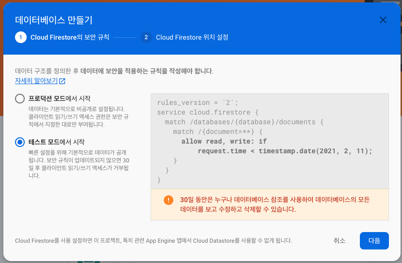
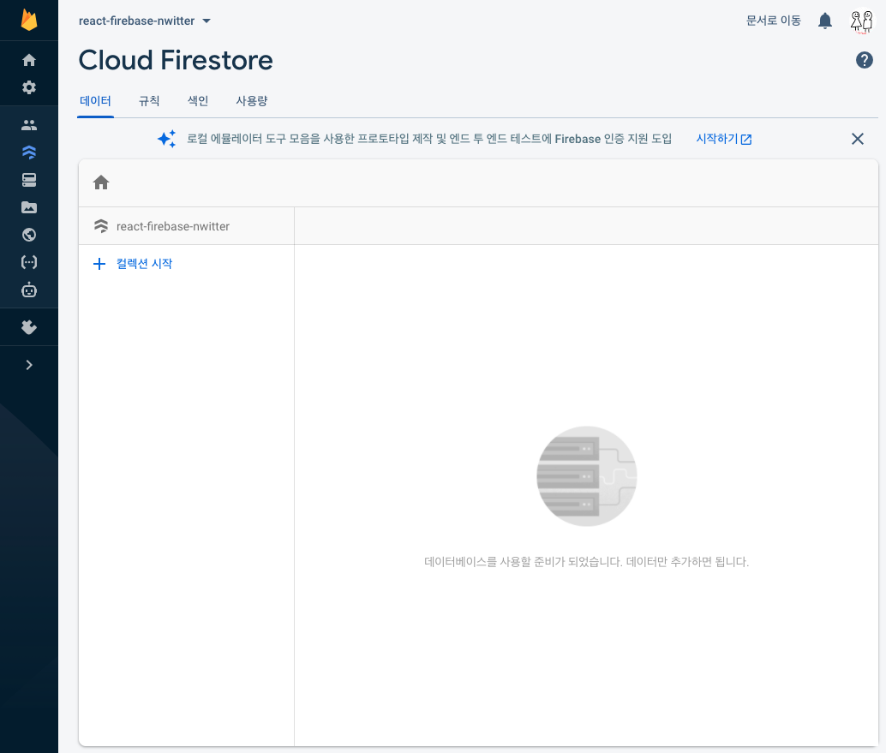

# Cloud firestore
Cloud firestore는 Firebase에서 제공하는 NoSQL 데이터베이스이다. 정말정말 유연하다.

> 대부분의 출처는 [노마드코더 강의](https://nomadcoders.co/nwitter) 와 [Firebase 공식문서](https://firebase.google.com/docs/auth/?authuser=0) 임을 밝힌다.
> [샘플코드](https://github.com/HyunAh-iia/react-firebase-nwitter) 는 깃헙에 올려두었다.

- 공식 홈페이지 : [Cloud Firestore](https://console.firebase.google.com/u/0/project/react-firebase-nwitter/firestore?hl=ko) 
- API 문서 : [firebase.firestore](https://firebase.google.com/docs/reference/js/firebase.firestore?hl=ko)
- 용어정리 NoSQL vs RDBMS
  - Collection vs Table
  - Document vs Record 또는 Row
  - Field vs Column



---

### 저장
Firebase console을 통해 직접 Collection(RDB에서의 Table)을 생성해줘도 되지만, 코드 상에서 바로 Document(RDB에서의 Row)를 추가해보겠다.
자세한 내용은 [firestore.collection](https://firebase.google.com/docs/reference/js/firebase.firestore.Firestore?hl=ko#collection) 문서를 통해 확인 가능하다.

[샘플코드](https://github.com/HyunAh-iia/react-firebase-nwitter/commit/99b38d54bb8d568a22eee6918ea42bf847806721)

1. Firebase - Cloud Firestore 데이터베이스를 생성
   
   
2. 트윗 저장하기 
   - 아래 코드는 `tweets`이라는 Collection에 트윗내용과 트윗일시를 저장한다는 뜻이다.
     ```jsx
     // dbService = firebase.firestore()
     await dbService.collection("tweets").add({
         tweet,
         createdAt: Date.now(),
     });
     ```
   - Firestore console에서 미리 Collection을 생성해주지 않아도, 코드상의 collection("path")에 적힌 path 명대로 Collection이 생성된다.
3. 샘플코드를 실행하여 로그인하면 홈 화면에서(아래가 홈화면이다ㅎㅎ) 트윗을 입력해보자.
   - 
4. Firestore console에 내가 입력한 트윗이 저장된 것을 확인할 수 있다.
   - 

---

### 조회
[샘플코드](https://github.com/HyunAh-iia/react-firebase-nwitter/commit/0b3a14e2151965e1cddfbf0cd5b09c3dd0258cf4)

좀 전에 등록한 '첫 트윗이다!'라는 트윗을 바로 조회해보자. 아직 UI를 입히지 않아 투박하지만 트윗을 등록한 후, DB에서 조회한 목록을 입력창 바로 아레에 출력한 형태이다. (아직 한 건 밖에 안보이지만 목록이 출력된다ㅎㅎ)
- 

---

Firebase를 이용하니까 간단하게 Auth, DB 처리까지 손쉽게 할 수 있었다.
본격적인 서비스에 도입하기에는 Firebase 자체에 너무 종속적이기 때문에 고객의 정보를 담기에는 부담스러울 수 있지만, 프로토타입이나 일상용 간편 기능을 만들기에 좋을 것 같다 :)
사실 단순한 CRUD 기능으로 구현된 어플 정도는 모두 Firebase를 이용해도 되지 않을까? Firebase를 진득하게(?) 써보지 않아서 확장성의 문제가 얼마나 있을 지는 모르겠지만, 지금 사용 경험으로는 충분히 합격이다. 