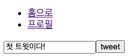

# Cloud firestore
Cloud firestore는 Firebase에서 제공하는 NoSQL 데이터베이스이다. 정말정말 유연하다.

Firebase를 이용하니까 간단하게 Auth, DB 처리까지 손쉽게 할 수 있었다.
본격적인 서비스에 도입하기에는 Firebase 자체에 너무 종속적이기 때문에 고객의 정보를 담기에는 부담스러울 수 있지만, 프로토타입이나 일상용 간편 기능을 만들기에 좋을 것 같다 :)
사실 단순한 CRUD 기능으로 구현된 대부분의 서비스는 모두 Firebase를 이용해도 되지 않을까 싶다. Firebase를 진득하게(?) 써보지 않아서 확장성의 문제가 얼마나 있을 지는 모르겠지만, 지금 사용 경험으로는 충분히 합격이다.

> 대부분의 출처는 [노마드코더 강의](https://nomadcoders.co/nwitter) 와 [Firebase 공식문서](https://firebase.google.com/docs/auth/?authuser=0) 임을 밝힌다.
> [샘플코드](https://github.com/HyunAh-iia/react-firebase-nwitter) 는 깃헙에 올려두었다.

- 공식 홈페이지 : [Cloud Firestore](https://console.firebase.google.com/u/0/project/react-firebase-nwitter/firestore?hl=ko) 
- API 문서 : [firebase.firestore](https://firebase.google.com/docs/reference/js/firebase.firestore?hl=ko)
- 용어정리 NoSQL vs RDBMS
  - Collection vs Table
  - Document vs Record 또는 Row
  - Field(data) vs Column

---

### Firestore 주요 class
- Table 레벨 : [CollectionReference class](https://firebase.google.com/docs/reference/node/firebase.firestore.CollectionReference)
  > A CollectionReference object can be used for adding documents, getting document references, and querying for documents (using the methods inherited from Query).
- Row 레벨 : [DocumentReference class](https://firebase.google.com/docs/reference/node/firebase.firestore.DocumentReference) 
  > A DocumentReference refers to a document location in a Firestore database and can be used to write, read, or listen to the location
   - Method : collection(), delete(), get(), isEqual(), onSnapshot(), set(), update(), withConverter()
   - Properties : firestore, id, parent, path
   

### onSnapshot class 구조
```javascript
    useEffect(() => {
        firebase.firestore().collection("tweets").onSnapshot(snapshot => { // snapshot => QuerySnapshot 
            // snapshot.docs => QueryDocumentSnapshot
            const tweetArray = snapshot.docs.map( doc=> ({
                id: doc.id,
                ...doc.data(), // QueryDocumentSnapshot.data()
            }));

            setTweets(tweetArray);
        })
    }, []);
```
- [QuerySnapshot](https://firebase.google.com/docs/reference/node/firebase.firestore.QuerySnapshot#docs)
   >  QuerySnapshot contains zero or more DocumentSnapshot objects representing the results of a query. The documents can be accessed as an array via the docs property or enumerated using the forEach method. The number of documents can be determined via the empty and size properties.
   - Properties : docs => DocumentSnapshot, empty, metadata, query, size
   - Method : docChanges(), forEach(), isEqual()
- [QueryDocumentSnapshot](https://firebase.google.com/docs/reference/node/firebase.firestore.QueryDocumentSnapshot#data)
   > A QueryDocumentSnapshot contains data read from a document in your Firestore database as part of a query. The document is guaranteed to exist and its data can be extracted with .data() or .get(<field>) to get a specific field.
     A QueryDocumentSnapshot offers the same API surface as a DocumentSnapshot. Since query results contain only existing documents, the exists property will always be true and data() will never return 'undefined'.
   - Methods : data(), get(), isEqual()
   - Properties : exists, id, metadata, ref

---

### 저장
Firebase console을 통해 직접 Collection(RDB에서의 Table)을 생성해줘도 되지만, 코드 상에서 바로 Document(RDB에서의 Row)를 추가해보겠다.
자세한 내용은 [firestore.collection](https://firebase.google.com/docs/reference/js/firebase.firestore.Firestore?hl=ko#collection) 문서를 통해 확인 가능하다.

[샘플코드](https://github.com/HyunAh-iia/react-firebase-nwitter/commit/99b38d54bb8d568a22eee6918ea42bf847806721)

1. Firebase - Cloud Firestore 데이터베이스를 생성
   
   
2. 트윗 저장하기 
   - 아래 코드는 `tweets`이라는 Collection에 트윗내용과 트윗일시를 저장한다는 뜻이다.
     ```jsx
     // dbService = firebase.firestore()
     await dbService.collection("tweets").add({
         tweet,
         createdAt: Date.now(),
     });
     ```
   - Firestore console에서 미리 Collection을 생성해주지 않아도, 코드상의 collection("path")에 적힌 path 명대로 Collection이 생성된다.
3. 샘플코드를 실행하여 로그인하면 홈 화면에서(아래가 홈화면이다ㅎㅎ) 트윗을 입력해보자.
   - 
4. Firestore console에 내가 입력한 트윗이 저장된 것을 확인할 수 있다.
   - 

---

### 조회
[샘플코드](https://github.com/HyunAh-iia/react-firebase-nwitter/commit/0b3a14e2151965e1cddfbf0cd5b09c3dd0258cf4)

좀 전에 등록한 '첫 트윗이다!'라는 트윗을 바로 조회해보자. 아직 UI를 입히지 않아 투박하지만 트윗을 등록한 후, DB에서 조회한 목록을 입력창 바로 아레에 출력한 형태이다. (아직 한 건 밖에 안보이지만 목록이 출력된다ㅎㅎ)
- 

---

# 실시간으로 데이터베이스 변경을 감지하여 데이터 가져오기(onSnapshot)
[Cloud Firestore로 실시간 업데이트 가져오기](https://firebase.google.com/docs/firestore/query-data/listen)
`onSnapshot`은 데이터베이스에 변화나 행위가 생겼을 때 알림을 받을 수 있는 일종의 listener이다. [샘플코드](https://github.com/HyunAh-iia/react-firebase-nwitter/commit/43a16c3d2c8e54c57f0aaf32373b7db39319d590) 는 깃헙에 올려두었다.
모든 변경을 감지하지 않고, 일부 행위에 대해서만 감지하도록 설정할 수 있다.
```
    useEffect(() => {
        dbService.collection("tweets").onSnapshot(snapshot => { //snapshot => QuerySnapshot
            //snapshot.docs => QueryDocumentSnapshot
            const tweetArray = snapshot.docs.map( doc=> ({
                id: doc.id,
                ...doc.data(), // QueryDocumentSnapshot.data()
            }));

            setTweets(tweetArray);
        })
    }, []);
```
`tweets` Collection에 변경이 감지되면 사용자가 리프레시를 하지 않더라도 데이터(댓글)를 화면에 다시 출력하는 코드이다.

---

# 색인(index)
### 복합색인
두 개 이상의 필드를 사용하여 쿼리를 조회해보자. 예제에서는 `tweets`라는 컬렉션(테이블)에서 `userId`가 x인 문서(행)을 찾아 `createdAt` 순으로 정렬한다.
```javascript    
const getMyTweets = async () => {
           const tweets = await dbService.collection("tweets")
               .where("userId", "==", userObj.uid)
               .orderBy("createdAt", "desc")
               .get();
           console.log(tweets.docs.map(doc=> doc.data()));
       }
```
별다른 설정없이 복합 필드로 쿼리를 조회할 경우 아래와 같은 메시지가 발생한다.

pre-made query를 통해 데이터베이스에게 이 쿼리를 사용할 거라고 미리 알려줘야한다.
에러메시지가 안내하는 링크를 타고 들어가면 Firestore의 친절한 가이드를 만나게 된다.
> Cloud Firestore는 단일 필드 색인에서 아직 지원하지 않는 복합 쿼리에 복합 색인을 사용합니다(예: 등호 및 범위 연산자 결합).

_생성.png)
기본적으로 오름차순으로 인덱스 생성을 권유한다. 최근 문서를 먼저 보고싶기 때문에 생성일시(createdAt)을 내림차순으로 변경하였다.