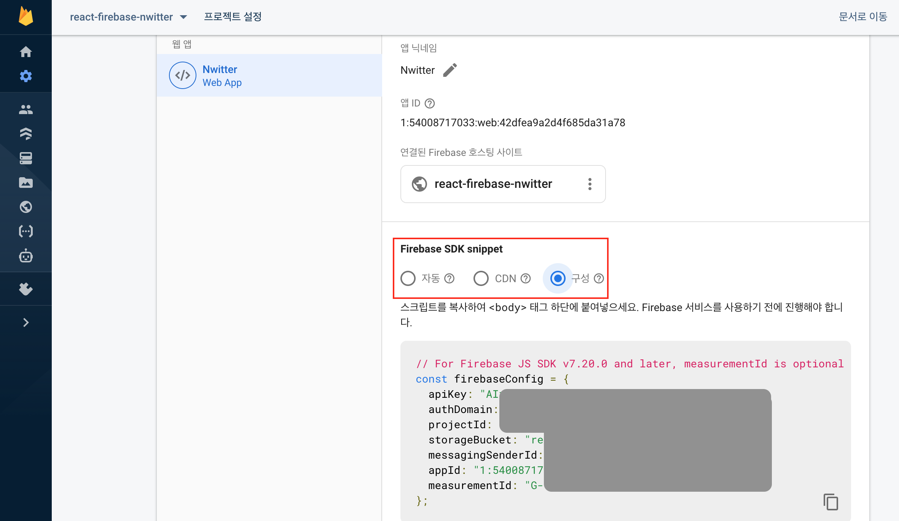
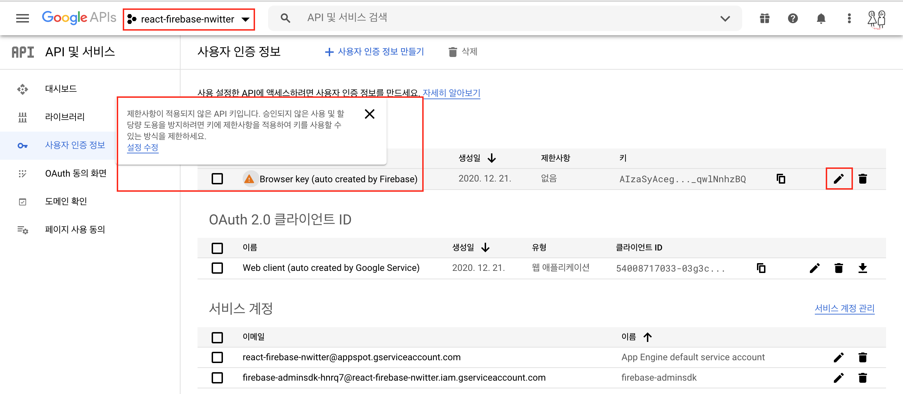
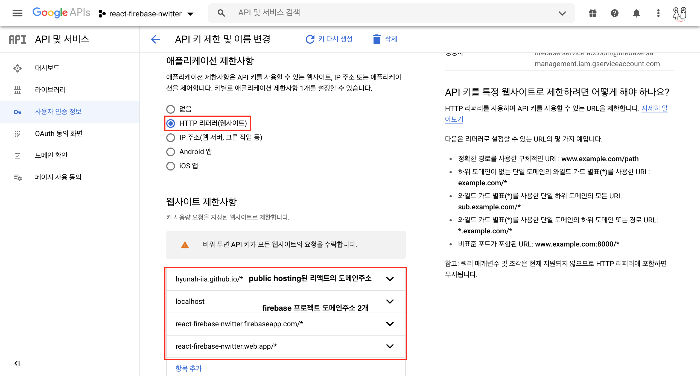
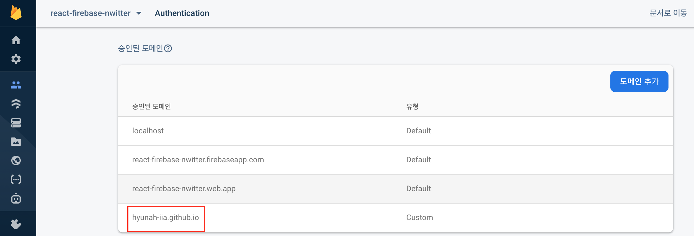
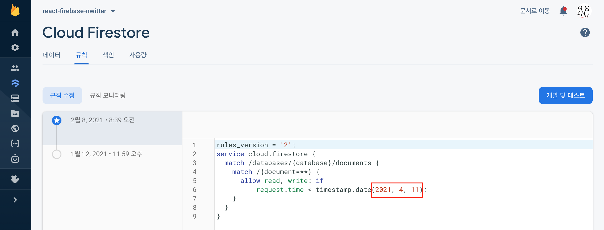

# Firebase Security
- [Firebaee 보안 규칙 가이드](https://firebase.google.com/docs/rules/get-started)
- [보안 규칙 작성 방법](https://firebase.google.com/docs/rules/rules-language)

### GCP API Key (Firebase Project 접근 API Key 관리)
1. API key 생성
    - [Firebase SDK 적용 및 사용예제 샘플코드](https://github.com/HyunAh-iia/react-firebase-nwitter/commit/846da15827a2a214fb6c3be18f2bd5b4209dc3d6)
      
    - 
2. API key 보안 적용
    - 
    - API Key를 사용하는 리액트의 호스팅 도메인(github page), localhost, Firebase Project 도메인 2개 등록 

### Firebase Auth 접근 가능 도메인 지정
특정 도메인에서만 접근을 허용하기 때문에 타인이 Firebase API Key를 가지고 있더라도 함부로 접근할 수 없다. 
`This domain (hyunah-iia.githun.io) is not authorized to run this operation. Add it to the OAuth redirect domains list in the Friebase console -> Auth section -> Sigh in method tab.`

### 보안 규칙(Firestore, Store)
1. `[Firebase] Cloud Firestore 데이터베이스에 대한 클라이언트 액세스가 3일 후에 만료됩니다`
    테스트용 데이터베이스를 만들어서 보안 규칙에 특정 일 이후로 만료되도록 설정되어 있다. 날짜를 변경하거나, 날짜 제한을 삭제하고 로그인한 사용자만 데이터베이스 읽기, 쓰기가 가능하게 변경할 수 있다.
    자세한 내용은 목차에 있는 '보안 규칙 작성 방법'을 참고하면 된다.
    
2. 보안 규칙은 정규식을 활용하여 path, param, 사용자 등을 통해 제법(?) 세밀한 권한처리가 가능하다.
    작성자 혹은 관리자인지에 따라 처리, read는 제한없이 풀어주고 write의 경우에만 권한 처리를 한다던가, storage 접근은 로그인한 사용자의 id에 해당하는(?) document에만 접근한다던가.. :) 유용해보이는 보안규칙이 가이드에 정리되어있다.