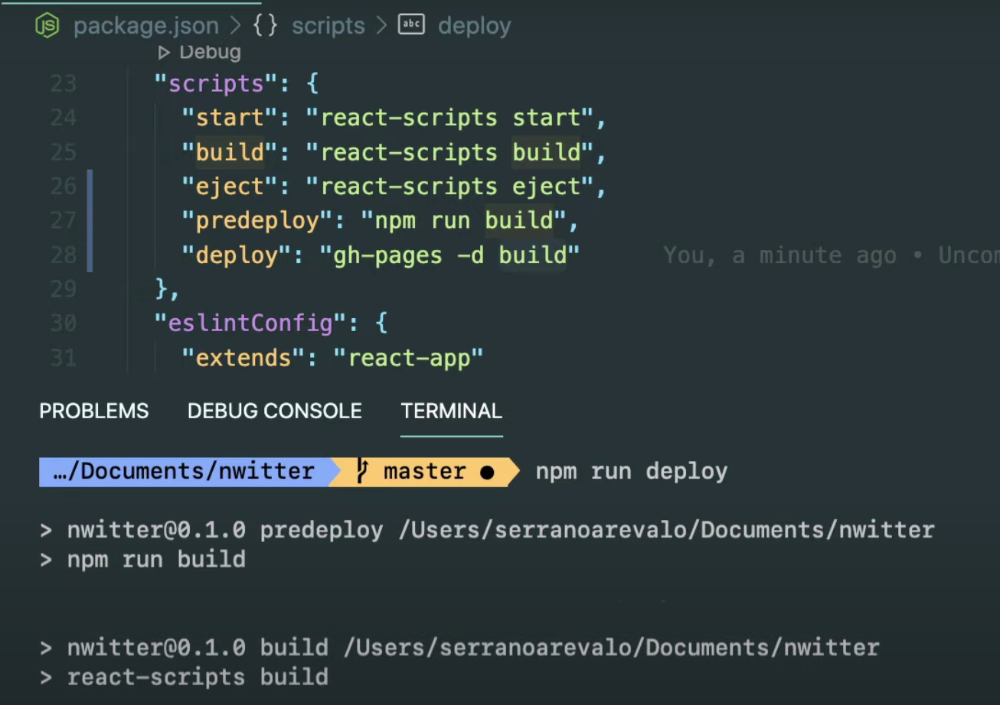

# Github Page를 이용한 호스팅

### React 배포하기
- [React 샘플코드](https://github.com/HyunAh-iia/react-firebase-nwitter/commit/325a59bf55d2a89fd06832684b589e4d1cfad50b)
- [호스팅된 깃헙 페이지](https://hyunah-iia.github.io/react-firebase-nwitter)

1. github page 배포용 라이브러리 설치
    ```
    npm i gh-pages
    ```

2. package.json 설정
    ```
      "scripts": {
        "start": "react-scripts start",
        "build": "react-scripts build",
        "eject": "react-scripts eject",
        "predeploy": "npm run build", <-- 추가
        "deploy": "gh-pages -d build" <-- 추가
      },
      ...
      "homepage": "https://hyunah-iia.github.io/react-firebase-nwitter" <-- https://내깃헙주소/레포명
    ```
    - `npm run deploy` : 해당 명령어를 수행하면 `predeploy` 스크립트가 선수행되고, deploy 스크립트인 `gh-pages -d build` 명령어 수행. build 디렉토리를 github 페이지로 호스팅하는 것임.
    
3. 접속해보자!
    - [깃헙 페이지](https://hyunah-iia.github.io/react-firebase-nwitter)

### 오류
1. ` A branch named 'gh-pages' already exists.`
  캐시를 지우면 되는데, 특정버전 이후 디렉토리 구조가 조금 바뀌었는 지 나는 두번째로 해야 접근가능했다.
   - `rm -rf node_modules/gh-pages/.cache` 
   - `rm -rf node_modules/.cache/gh-pages`
2. github permission denied
    - fetch/push 권한은 있는데 `gh-pages` 시 권한이 없다며 반려되는 현상 
      ```
      remote: Permission to HyunAh-iia/react-firebase-nwitter.git denied to hyunah-kim.
      fatal: unable to access 'https://github.com/HyunAh-iia/react-firebase-nwitter.git/': The requested URL returned error: 403
      ```
    - [도움받은 블로그](https://michigusa-nlp.tistory.com/74)

