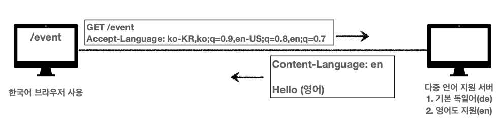

#HTTP 헤더
> 강의 [모든 개발자를 위한 HTTP 웹 기본 지식](https://www.inflearn.com/course/http-%EC%9B%B9-%EB%84%A4%ED%8A%B8%EC%9B%8C%ED%81%AC/dashboard) 와 개인적으로 공부한 내용을 정리하였습니다.

## HTTP 헤더 개요
- HTTP 전송에 필요한 모든 부가정보를 담음
- 예) 메시지 바디의 내용, 메시지 바디의 크기, 압축, 인증, 요청 클라이언트, 서버 정보, 캐시 관리 정보 등
- 표준헤더가 굉장히 많음
- 필요 시 임의의 헤더 추가 가능
- 2014년 HTTP 표준 개정으로 RFC2616 -> RFC7230~7235로 변화됨

### 과거의 헤더(RFC2616)
- General 헤더: 메시지 전체에 적용되는 정보, 예) Connection: close
- Request 헤더: 요청 정보, 예) User-Agent: Mozilla/5.0 (Macintosh; ..)
- Response 헤더: 응답 정보, 예) Server: Apache
- Entity 헤더: 엔티티 바디 정보, 예) Content-Type: text/html, Content-Length: 3423

### 과거의 본문(RFC2616)
- 메시지 본문(message body)은 엔티티 본문(entity body)을 전달하는데 사용
- 엔티티 본문은 요청이나 응답에서 전달할 실제 데이터
- 엔티티 헤더는 엔티티 본문의 데이터를 해석할 수 있는 정보 제공
- 데이터 유형(html, json), 데이터 길이, 압축 정보 등등

## 새로운 HTTP 표준(RFC723x)
- `엔티티(Entity)` 라는 단어 대신 `표현(Representation)` 라는 단어 사용 (완벽한 1:1 대응은 아님)
- `표현(Representation)` = Representation Metadata(표현 메타데이터) + Representation Data(표현 데이터)
- 표현의 의미 : 회원이라는 리소스를 실제 데이터로 전송할 때는 json나 html로 표현해서 전달할 수도 있기 때문에 표현이라는 단어를 사용

### 새로운 본문, 표현 데이터(RFC723x)
- 메시지 본문(message body)을 통해 표현 데이터 전달
- 메시지 본문 = 페이로드(payload)
- 표현은 요청이나 응답에서 전달할 실제 데이터
- 표현 헤더는 표현 데이터를 해석할 수 있는 정보 제공 (데이터 유형(html, json), 데이터 길이, 압축 정보 등등)
- 참고: 표현 헤더는 표현 메타데이터와, 페이로드 메시지를 구분해야 하지만, 여기서는 생략
  
### 메시지 본문에 대한 헤더, 표현 메타 데이터(RFC723x)
- Content-Type: 표현 데이터의 형식(미디어 타입, 문자 인코딩)
    - text/html; charset=utf-8
    - application/json (참고로 default charset은 utf-8임)
    - image/png
- Content-Encoding: 표현 데이터의 압축 방식. 표현 데이터를 압축하기 위해 사용
    - gzip (요즘 많이 사용)
    - deflate
    - identity (압축 없음)
- Content-Language: 표현 데이터의 자연 언어
    - ko
    - en
- Content-Length: 표현 데이터의 길이
    - 바이트 단위
    - Transfer-Encoding(전송 코딩)을 사용하면 Content-Length를 사용하면 안됨
    
## 협상(콘텐츠 네고시에이션)
- Accept: 클라이언트가 선호하는 미디어 타입 전달
- Accept-Charset: 클라이언트가 선호하는 문자 인코딩
- Accept-Encoding: 클라이언트가 선호하는 압축 인코딩
- Accept-Language: 클라이언트가 선호하는 자연 언어
- 요청 시에만 사용
  ```
  클라이언트 : 내가 원하는 우선 순위와 원하는 표현 방식으로 응답을 줘!
  서버 : 그래, 가능하다면 그렇게 할게!
  ```

### 협상 이해를 위한 예제) Accept-Language
1. 다중언어를 지원하는 서버에 `Accept-Language`를 설정하지 않았을 경우, 서버에서 정한 Default 언어로 제공될 가능성이 큼
  
2. 요청 시 헤더에 `Accept-Language`를 설정
  
3. 요청한 언어를 지원하지 않을 경우, 우선순위를 설정해 선호 언어에 대한 요청을 할 수 있음
  
4. 실무에서는 어떻게 사용할까? 구글에 검색해보기 (한글에 대한 우선순위가 제일 높고, 이후 영어에 대한 우선순위가 존재하는 것을 확인할 수 있음)
  

### 협상과 우선순위
**값이 클수록**
- Quality Values(q) 값 사용
- 0~1, 클수록 높은 우선순위 (생략하면 1)
- 예) `Accept-Language: ko-KR,ko;q=0.9,en-US;q=0.8,en;q=0.7`
    - ko-KR;q=1 (q생략)
    - ko;q=0.9
    - en-US;q=0.8
    - en:q=0.7

**구체적일수록**
- 구체적인 것을 우선함
- 예) `Accept: text/*, text/plain, text/plain;format=flowed, */*`
    - text/plain;format=flowed
    - text/plain
    - text/*
    - \*/\*

**구체적인 것과 값 혼용**
- 예) `Accept: text/*;q=0.3, text/html;q=0.7, text/html;level=1,

      text/html;level=2;q=0.4, */*;q=0.5`

## 전송 방식
- 단순 전송(Content-Length)
  
- 압축 전송(Content-Encoding)
  
- 분할 전송(Transfer-Encoding)
  
- 범위 전송(Range, Content-Range)
  
  
## 일반적인 정보성 헤더 필드
- From: 유저 에이전트의 이메일 정보 (요청에서 사용)
    -  일반적으로 잘 사용되지 않으며 검색엔진 같은 곳에서 주로 사용
- Referer: 이전 웹 페이지 주소 (요청에서 사용)
    - Referer를 통해 유입경로 분석 가능
    - referrer의 오타가 굳어짐ㅎㅎ
- User-Agent: 유저 에이전트 애플리케이션 정보
    - 클리이언트의 애플리케이션 정보(웹 브라우저 정보, 등등)
    - 어떤 종류의 브라우저에서 장애가 발생하는지 파악 가능
    - 통계 정보
- Server: 요청을 처리하는 오리진 서버의 소프트웨어 정보 (응답에서 사용)
    - 오리진 서버? : HTTP 요청을 하면 중간에 여러 프록시 서버와 캐시 서버 등을 거치게 됨. 실제 클라이언트의 요청에 대해 응답해주는 서버를 오리진 서버라 함
- Date: 메시지가 생성된 날짜 (응답에서 사용, 과거 스펙에서는 요청에서도 사용했음)

## 특별한 헤더
- Host: 요청한 호스트 정보(도메인) : 하나의 서버에 여러 개의 어플리케이션을 구동하고 있을 수 있는데, IP로만 통신하면 이를 구분할 수 없으니 HOST 헤더를 추가하여 식별
- Location: 페이지 리다이렉션, 응답 상태코드가 201 Created, 3xx 리다이렉션인 경우 사용됨 
- Allow: 허용 가능한 HTTP 메서드 : 클라이언트가 제공되지 않는 HTTP 메서드 요청 시 405와 함께 허용 가능한 HTTP 메서드를 Allow 헤더에 안내하여 제공함 (근데 이를 구현한 서버는 많지 않음)
- Retry-After: 유저 에이전트가 다음 요청을 하기까지 기다려야 하는 시간

## 인증
- Authorization: 클라이언트 인증 정보를 서버에 전달 (`Authorization: Basic xxxxxxxxxxxxxxxx`)
- WWW-Authenticate: 리소스 접근시 필요한 인증 방법 정의
    - 401 Unauthorized 응답과 함께 사용
    - 클라이언트에게 리소스 접근 시 필요한 인증 방법을 안내함
    - `WWW-Authenticate: Newauth realm="apps", type=1, title="Login to \"apps\"", Basic realm="simple"`

## 쿠키
- Set-Cookie: 서버에서 클라이언트로 쿠키 전달(응답)
- Cookie: 클라이언트가 서버에서 받은 쿠키를 저장하고, HTTP 요청시 서버로 전달
- 예) `set-cookie: sessionId=abcde1234; expires=Sat, 26-Dec-2020 00:00:00 GMT; path=/; domain=.google.com; Secure`
- 어디에 사용될까?
    - 사용자 로그인 세션 관리
    - 광고 정보 트래킹
- 쿠키 정보는 항상 서버에 전송됨(모든 요청에 쿠키 정보 자동 포함)
    - 네트워크 트래픽 추가 유발
    - 최소한의 정보만 사용(세션 id, 인증 토큰)
    - 서버에 전송하지 않고, 웹 브라우저 내부에 데이터를 저장하고 싶으면 웹 스토리지 (localStorage, sessionStorage) 참고
- 주의! 보안에 민감한 데이터는 저장하면 안됨(주민번호, 신용카드 번호 등등)

### 로그인한 사용자 정보를 어떻게 기억하게 할까?
- HTTP 통신은 기본적으로 무상태(Stateless) 프로토콜
- 대안1 : 모든 요청에 사용자 정보를 포함하여 보낸다
    - 모든 요청에 사용자 정보가 포함되도록 개발해야함
    - 브라우저를 완전히 종료하고 열면? (웹 스토리지에 저장이 가능하긴 한데 어쨋든 모든 요청에 사용자 정보를 저장하도록 개발하는게 번거롭고 힘들겠지)
- 대안2 : 쿠키를 사용한다
    - 
    - 
    - 하지만 보안에 문제가 되겠지. 이를 제약하는 방법이 있으니 쿠키에 대해 더 알아보자.
    
### 쿠키 - 생명주기(Expires, max-age)
- expires(만료일이 되면 쿠키 삭제) : `Set-Cookie: expires=Sat, 26-Dec-2020 04:39:21 GMT`
- max-age(0이나 음수를 지정하면 쿠키 삭제, 초단위) : `Set-Cookie: max-age=3600`
- 세션 쿠키: 만료 날짜를 생략하면 브라우저 종료 시까지만 유지
- 영속 쿠키: 만료 날짜를 입력하면 해당 날짜까지 유지

### 쿠키 - 도메인(Domain)
- 도메인을 명시하는 경우 (ex: `domain=example.org`)
    - example.org 쿠키 접근
    - dev.example.org 쿠키 접근 가능 (하위 도메인)
- 도메인을 생략하는 경우, 쿠키를 생성한 도메인만 접근 가능하며 하위 도메인은 쿠키 미접근
    - example.org 쿠키 접근
    - dev.example.org 쿠키 미접근

### 쿠키 - 경로
- 쿠키 기능 상 보통 모든 루트에서 접근 가능하게 사용함. 일반적으로 `path=/`로 사용함
- 경로를 지정한 경우, 해당 경로와 하위 경로에 대해서만 접근 가능
- 예) `path=/home` 지정
    - `/home` -> 가능
    - `/home/level1` -> 가능 
    - `/hello` -> 불가능
    
### 쿠키 - 보안(Secure, HttpOnly, SameSite)
- Secure
    - 쿠키는 http, https를 구분하지 않고 전송
    - Secure를 적용하면 https인 경우에만 전송
- HttpOnly
    - XSS 공격 방지
    - 자바스크립트에서 접근 불가(document.cookie) 
    - HTTP 전송에만 사용
- SameSite
    - XSRF 공격 방지
    - 요청 도메인과 쿠키에 설정된 도메인이 같은 경우만 쿠키 전송
    - 기능이 적용된 지 얼마되지 않았기 때문에 브라우저에서 지원하는 지 확인