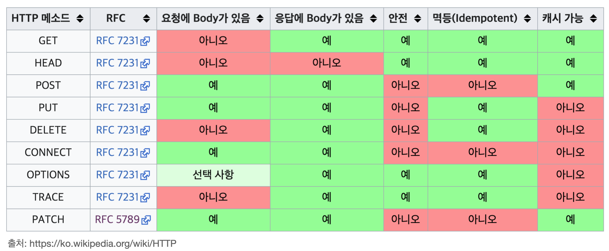
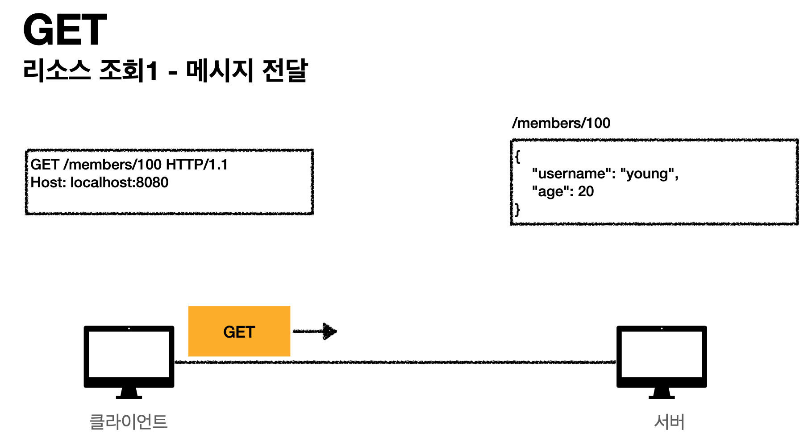
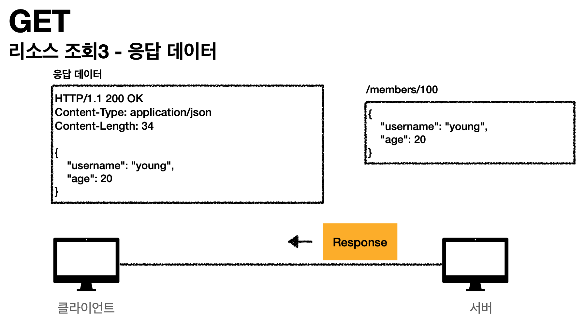
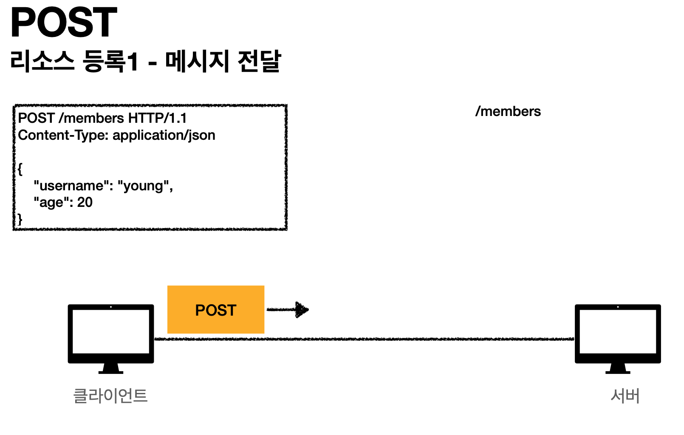
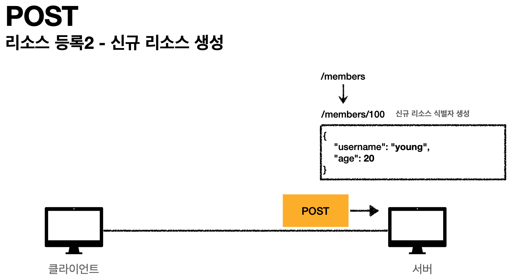
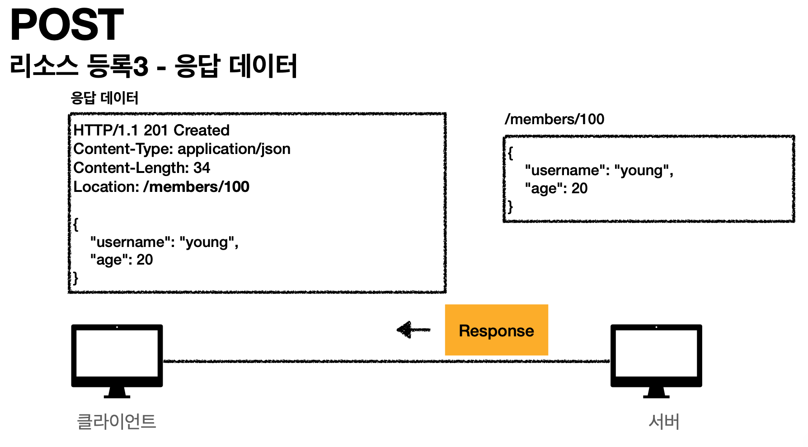

#HTTP Method
> 강의 [모든 개발자를 위한 HTTP 웹 기본 지식](https://www.inflearn.com/course/http-%EC%9B%B9-%EB%84%A4%ED%8A%B8%EC%9B%8C%ED%81%AC/dashboard) 와 개인적으로 공부한 내용을 정리하였습니다.



## GET
```
GET /members/100 HTTP/1.1
Host: localhost:8080

```
- 리소스 조회
- 서버에 전달하고 싶은 데이터는 query(쿼리 파라미터, 쿼리 스트링)를 통해서 전달
- 메시지 바디를 사용해서 데이터를 전달할 수 있지만, 지원하지 않는 곳이 많아서 권장하지 않음
- 
- 

## POST
```
POST /members HTTP/1.1 
Content-Type: application/json

{
"username": "hello", "age": 20
}
```
- 요청 데이터 처리
- 메시지 바디를 통해 서버로 요청 데이터 전달
- 서버는 요청 데이터를 처리(메시지 바디를 통해 들어온 데이터를 처리하는 모든 기능을 수행) 
- 주로 전달된 데이터로 신규 리소스 등록, 프로세스 처리에 사용
- 
- 
- 
    - 신규로 자원이 생성되면 상태를 `201(Created)`
    - 201 상태로 응답할땐 리소스(id)가 생성된 위치(path)를 `Location`로 함께 보내주네?!

#### POST는 요청 데이터를 어떻게 처리하라는 뜻일까? (예시)
- [HTTP 공식 스펙](https://tools.ietf.org/html/rfc7231#section-4.3.3)
- 스펙: POST 메서드는 대상 리소스가 리소스의 고유 한 의미 체계에 따라 요청에 포함 된 표현을 처리하도록 요청합니다. (구글 번역) 
- 예를 들어 POST는 다음과 같은 기능에 사용됩니다.
    - HTML 양식에 입력 된 필드와 같은 데이터 블록을 데이터 처리 프로세스에 제공
        - 예) HTML FORM에 입력한 정보로 회원 가입, 주문 등에서 사용
    - 게시판, 뉴스 그룹, 메일링 리스트, 블로그 또는 유사한 기사 그룹에 메시지 게시
        - 예) 게시판 글쓰기, 댓글 달기
    - 서버가 아직 식별하지 않은 새 리소스 생성
        - 예) 신규 주문 생성
    - 기존 자원에 데이터 추가
        - 예) 한 문서 끝에 내용 추가하기
- 정리: 이 리소스 URI에 POST 요청이 오면 요청 데이터를 어떻게 처리할지 리소스마다 따로 정해야 함 -> 정해진 것이 없음

#### POST 정리
1. 새 리소스 생성(등록)
    - 서버가 아직 식별하지 않은 새 리소스 생성
2. 요청 데이터 처리
    - 단순히 데이터를 생성하거나, 변경하는 것을 넘어서 프로세스를 처리해야 하는 경우
        - 예) 주문에서 결제완료 -> 배달시작 -> 배달완료 처럼 단순히 값 변경을 넘어 프로세스의 상태가 변경되는 경우 
    - POST의 결과로 새로운 리소스가 생성되지 않을 수도 있음 (URI설계는 리소스 단위로 설계해야하는데, 어쩔 수 없을 때)
        - 예) POST /orders/{orderId}/start-delivery (컨트롤 URI)
3. 다른 메서드로 처리하기 애매한 경우
    - 예) JSON으로 조회 데이터를 넘겨야 하는데, GET 메서드를 사용하기 어려운 경우
    - 애매하면 POST

## PUT
```
PUT /members/100 HTTP/1.1 
Content-Type: application/json

{
"username": "hello", "age": 20
}
```
- 리소스를 대체
- 리소스가 있으면 대체 리소스가 없으면 생성 (쉽게 이야기해서 덮어버림)
- 클라이언트가 리소스 위치를 알고 URI 지정한다는 점에서 POST와 다름

## PATCH
```
PATCH /members/100 HTTP/1.1
Content-Type: application/json

{
"age": 50
}
```
- 리소스 부분 변경
- PATCH가 지원이 안되는 서버가 종종 있음, 그럴 때에는 POST 사용하면 됨


## DELETE
```
DELETE /members/100 HTTP/1.1
Host: localhost:8080

```
- 리소스 삭제