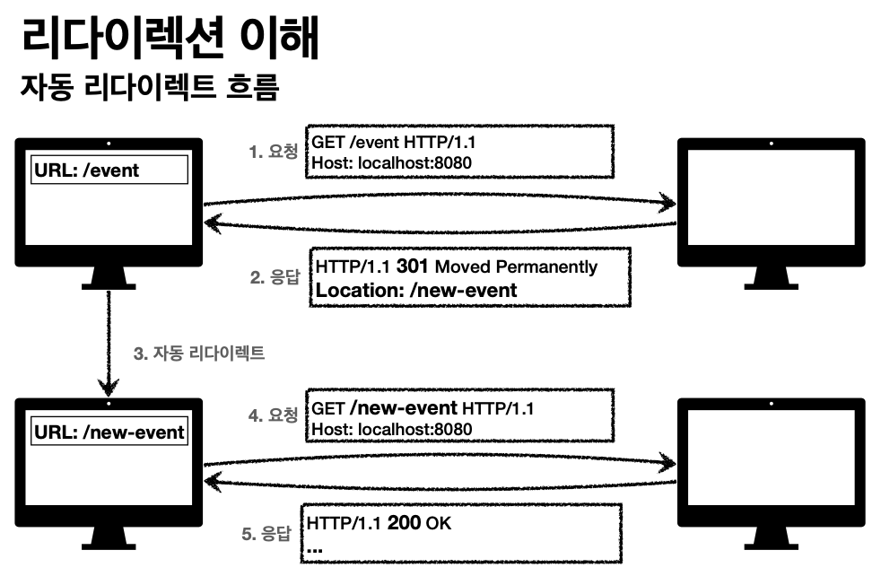
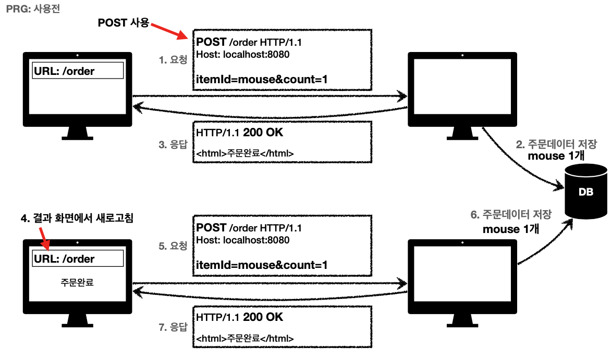
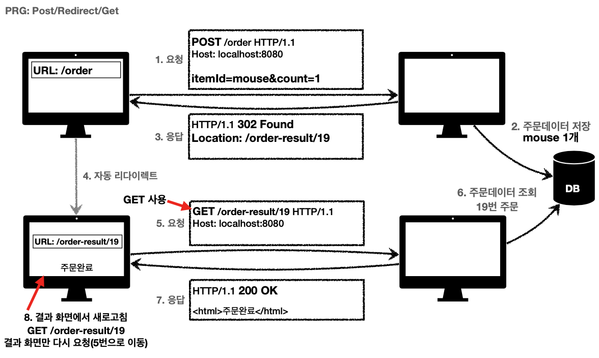

#HTTP 상태코드와 일시적 리다이렉션(PRG)
> 강의 [모든 개발자를 위한 HTTP 웹 기본 지식](https://www.inflearn.com/course/http-%EC%9B%B9-%EB%84%A4%ED%8A%B8%EC%9B%8C%ED%81%AC/dashboard) 와 개인적으로 공부한 내용을 정리하였습니다.

## HTTP 상태코드
클라이언트가 보낸 요청의 처리 상태를 응답에서 알려주는 기능으로, 클라이언트가 인식할 수 없는 상태코드가 반환되면 상위 상태코드로 해석하여 처리
- 1xx (Informational): 요청이 수신되어 처리중 (잘안씀ㅎ)
- 2xx (Successful): 요청 정상 처리
- 3xx (Redirection): 요청을 완료하려면 추가 행동이 필요
- 4xx (Client Error): 클라이언트 오류, 잘못된 문법등으로 서버가 요청을 수행할 수 없음 5xx (Server Error): 서버 오류, 서버가 정상 요청을 처리하지 못함
- 5xx (Server Error) : 서버 오류, 

## 2XX (Successful)
클라이언트의 요청을 성공적으로 처리
- 200 OK
- 201 Created : 요청 성공해서 새로운 리소스가 생성됨, 생성된 리소스는 응답의 Location 헤더로 식별
- 202 Accepted : 요청이 접수되었으나 처리가 완료되지 않았음 (배치 등)
- 204 No Content : 서버가 요청을 정상 수행했지만, 응답 페이로드 본문에 보낼 데이터가 없음 (저장 버튼 등)

## 3xx (Redirection)
클라이언트의 요청을 완료하기 위해 서버가 추가적인 작업이 필요하다고 클라이언트에 반환함

웹브라우저는 3xx 응답의 결과에 Location 헤더가 있으면, 해당 Location 위치에 자동 이동함(리다이렉트)

### 리다이렉션의 종류
1. 영구 리다이렉션 : 특정 리소스의 URI가 영구적으로 이동, 원래의 URL를 사용X, 검색 엔진 등에서도 변경 인지
    - 301 Moved Permanently : `POST -> Redirect -> GET` 리다이렉트시 요청 메서드가 GET으로 변하고, 본문이 제거될 수 있음(MAY, 근데 대부분 GET으로 변경됨)
    - 308 Permanent Redirect : `POST -> Redirect -> POST` 301과 기능은 같음, 리다이렉트시 요청 메서드와 본문 유지(처음 POST를 보내면 리다이렉트도 POST 유지)
    - 실무에서는 영구 리다이렉션은 잘 사용하지 않으며, 일시적 리다이렉션을 주로 사용함
2. 일시적 리다이렉션 : `PRG: Post/Redirect/Get` 리소스의 URI가 일시적으로 변경, 따라서 검색 엔진 등에서 URL을 변경하면 안됨 ex) 주문 완료 후 주문 내역 화면으로 이동
    - 302 Found : 리다이렉트시 요청 메서드가 GET으로 변하고, 본문이 제거될 수 있음(MAY, 근데 대부분 GET으로 변경됨)
    - 307 Temporary Redirect : 302와 기능 동일. 리다이렉트시 요청 메서드와 본문 유지(요청 메서드를 변경하면 안된다. MUST NOT)
    - 303 See Other : 302와 기능 동일. 리다이렉트시 요청 메서드가 GET으로 변경
    - 모호한 302를 대신하는 명확한 307, 303이 등장하였으나 실무에서는 많은 라이브러리들이 302를 기본값으로 사용중
3. 특수 리다이렉션 : 결과 대신 캐시를 사용
    - 300 Multiple Choices: 미사용
    - 304 Not Modified : 캐시를 목적으로 사용. 클라이언트에게 리소스가 변경되지 않았으니 로컬 캐시를 사용하라고 알려주는 것(캐시로 리다이렉트)
    
### 일시적 리다이렉션 PRG: Post/Redirect/Get
- PRG 사용 전 문제점
    - POST로 주문후에 웹 브라우저를 새로고침하면 POST가 재요청 됨 (중복 처리 발생)
    - 
    - ex) 주문 완료 후 새로고침을 하여 중복 주문이 됨
- PRG 적용
    - POST로 주문후에 주문 결과 화면을 GET 메서드로 리다이렉트하여 새로 고침으로 인한 중복 주문 방지
    - 
    - ex) 주문 완료 후 새로고침을 해도 GET으로 결과화면을 조회함
    - 원칙적으로 중복 처리는 서버에서 막아야하나, 클라이언트에서도 한번 더 막아주면 좋겠지!

## 4xx (Client Error)
클라이언트의 요청에 잘못된 문법등으로 서버가 요청을 수행할 수 없음(오류의 원인이 클라이언트에 있음). 요청이 잘못되었기 때문에 재시도해도 실패함
- 400 Bad Request : 클라이언트가 잘못된 요청을 해서 서버가 요청을 처리할 수 없음
- 401 Unauthorized : 인증(Authentication) 되지 않음. 클라이언트가 해당 리소스에 대한 인증이 필요함. 401 오류 발생시 응답에 WWW-Authenticate 헤더와 함께 인증 방법을 설명 . 이름은 Unauthorized(인가되지 않음)이지만 인증되지 않았다는 뜻임!
- 403 Forbidden : 서버가 요청을 이해했지만 승인을 거부함 (권한 불충분, 로그인은 했지만 리소스 접근 권한이 없는 경우)
- 404 Not Found : 요청 리소스를 찾을 수 없음 혹은  클라이언트가 권한이 부족한 리소스에 접근할 때 해당 리소스를 숨기고 싶을 때(해당 리소스의 존재까지!)

## 5xx (Server Error)
서버 문제로 오류 발생하였기 때문에 요청을 재시도 하면 성공할 수도 있음(복구가 되거나 등등)
- 500 Internal Server Error : 서버 문제로 오류 발생, 애매하면 500 오류
- 503 Service Unavailable : 서비스 이용 불가(서버가 일시적인 과부하 또는 예정된 작업으로 잠시 요청을 처리할 수 없음). 근데 거의 사용안함ㅎㅎ

### 4xx과 5xx의 구분
- 4xx과 5xx의 차이는 동일 요청 재시도 시 성공여부! (4xx -> 요청이 잘못되서 재시도해도 실패야. 5xx -> 서버 문제 해결되면 재시도시 성공할 수도 있어)
- 5xx 에러는 함부로 발생하면 안됨. 진짜 서버 문제(NPE, 쿼리 이상, DB 이상)일때만!
- 클라이언트의 요청이 올바르나, 비즈니스 로직 상 오류인 경우는 4xx이나 2xx으로 풀어야한다. (ex: 잔고 부족한데 출금 요청)
