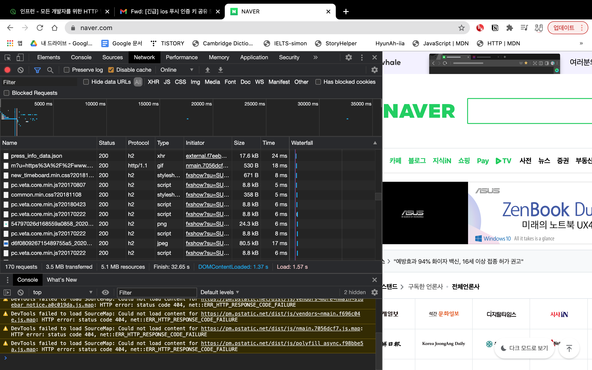

#HTTP(HyperText Transfer Protocol)
> 강의 [모든 개발자를 위한 HTTP 웹 기본 지식](https://www.inflearn.com/course/http-%EC%9B%B9-%EB%84%A4%ED%8A%B8%EC%9B%8C%ED%81%AC/dashboard) 와 개인적으로 공부한 내용을 정리하였습니다.

#### HTTP 메시지에 모든 것을 전송
- HTML, TEXT
- IMAGE, 음성, 영상, 파일
- JSON, XML (API)
- 거의 모든 형태의 데이터 전송 가능
- 서버간에 데이터를 주고 받을 때도 대부분 HTTP 사용 
- 지금은 HTTP 시대!

##### HTTP 역사
- HTTP/0.9 1991년: GET 메서드만 지원, HTTP 헤더X
- HTTP/1.0 1996년: 메서드, 헤더 추가
- HTTP/1.1 1997년: 가장 많이 사용, 우리에게 가장 중요한 버전
- RFC2068 (1997) -> RFC2616 (1999 - 21년 현재 50% 이상 확률로 해당 기준으로 문서가 설명되어있음) -> RFC7230~7235 (2014) HTTP/2 2015년: 성능 개선
- HTTP/3 진행중: TCP 대신에 UDP 사용, 성능 개선
- [참고] 2021년 3월 30일 이후부터 iOS 기존 푸시인증서 방식이 종료되고 KEY HTTP/2 방식으로 변경됨 => [애플안내](https://developer.apple.com/news/?id=7gx0a2lp )

##### 기반 프로토콜
- TCP: HTTP/1.1, HTTP/2 UDP: HTTP/3
- 현재 HTTP/1.1 주로 사용
- HTTP/2, HTTP/3 도 점점 증가
- 
- 크롬 개발자도구를 열어서 확인해보면 `http/1.1`, `h2(HTTP/2)`, `h3-*(HTTP/3)` 프로토콜을 사용하는 것을 확인할 수 있음
- HTTP 2와 3은 성능이 향상된 것이니, 일단 HTTP/1.1 스펙을 잘 이해하는 게 중요

##### HTTP 특징
- 클라이언트 서버 구조
- 무상태 프로토콜(스테이스리스), 비연결성 HTTP 메시지
- 단순함, 확장 가능
    - HTTP는 단순하다. 스펙도 읽어볼만...
    - HTTP 메시지도 매우 단순
    - 크게 성공하는 표준 기술은 단순하지만 확장 가능한 기술
