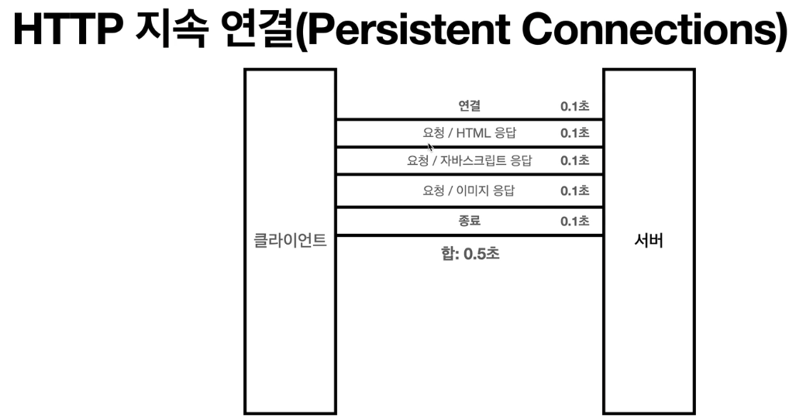

#비 연결성(connectionless)
> 강의 [모든 개발자를 위한 HTTP 웹 기본 지식](https://www.inflearn.com/course/http-%EC%9B%B9-%EB%84%A4%ED%8A%B8%EC%9B%8C%ED%81%AC/dashboard) 와 개인적으로 공부한 내용을 정리하였습니다.

#### 비 연결성
- HTTP는 기본이 연결을 유지하지 않는 모델 
- 일반적으로 초 단위의 이하의 빠른 속도로 응답
- 1시간 동안 수천명이 서비스를 사용해도 실제 서버에서 동시에 처리하는 요청은 수십개 이 하로 매우 작음
    - 예) 웹 브라우저에서 계속 연속해서 검색 버튼을 누르지는 않는다. 
- 서버 자원을 매우 효율적으로 사용할 수 있음

#### 한계와 극복
- TCP/IP 연결을 새로 맺어야 함 - 3 way handshake 시간 추가
- 웹 브라우저로 사이트를 요청하면 HTML 뿐만 아니라 자바스크립트, css, 추가 이미지 등등 수 많은 자원이 함께 다운로드
- 지금은 HTTP 지속 연결(Persistent Connections)로 문제 해결!!
- HTTP/2, HTTP/3에서 더 많은 최적화
- 

#### 스테이스리스를 기억하자
- 서버 개발자들이 어려워하는 업무
- 정말 같은 시간에 딱 맞추어 발생하는 대용량 트래픽
    - 예) 선착순 이벤트, 명절 KTX 예약, 학과 수업 등록
    - 예) 저녁 6:00 선착순 1000명 치킨 할인 이벤트 -> 수만명 동시 요청
- 최대한 스테이리스한 설계를 해야지만 이런 대용량 트래픽 이벤트가 생겼을 때 스케일아웃(서버 확 늘려서)으로 대응 가능