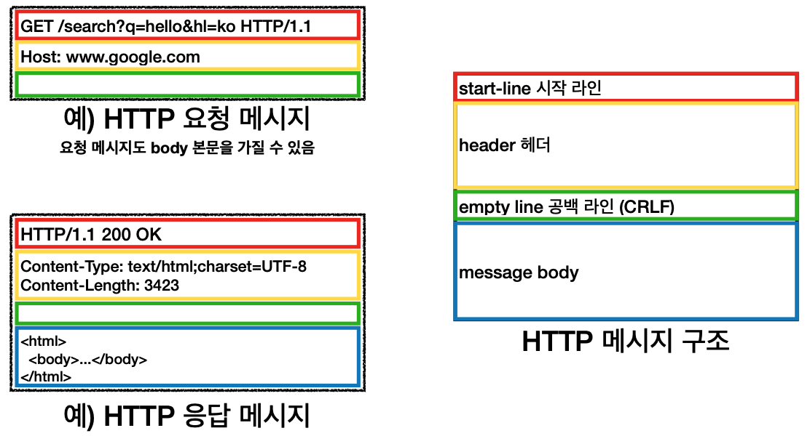

# HTTP 메시지
> 강의 [모든 개발자를 위한 HTTP 웹 기본 지식](https://www.inflearn.com/course/http-%EC%9B%B9-%EB%84%A4%ED%8A%B8%EC%9B%8C%ED%81%AC/dashboard) 와 개인적으로 공부한 내용을 정리하였습니다.



[HTTP 메시지 공식 스펙](https://tools.ietf.org/html/rfc7230#section-3)
```
 HTTP-message   = start-line
                  *( header-field CRLF )
                  CRLF
                  [ message-body ]
```

## 시작라인(start-line) - 빨간박스
- 시작라인은 `request-line`과 `status-line`으로 구성되어 있는데, 요청메시지에서는 `request-line`이라고 표현함

#### 요청메시지
- `request-line` = 메서드 SP(공백) request-target(path) SP HTTP버전 CRLF(엔터)
- ex) `GET /search?q=hello&hl=ko HTTP/1.1` 
    - 메서드 : GET
    - 요청대상(path) : /search?q=hello&hl=ko, 보통 절대 경로로 구성
    - HTTP 버전 : HTTP/1.1

#### 응답메시지
- `status-line`이라고 표현
- `status-line` = HTTP버전 SP status-code SP reason-phrase(이유문구-readable) CRLF

## HTTP Header - 노란박스
- `header-field` = field-name ":" OWS field-value OWS  (OWS:띄어쓰기 허용, Optional)
- field-name은 대소문자 구문 없음
- HTTP 전송에 필요한 모든 부가정보(메타정보 덩어리)
    - 예) 메시지 바디의 내용, 메시지 바디의 크기, 압축 여부, 인증, 요청 클라이언트(브라우저) 정보, 서버 애플리케이션 정보, 캐시 관리 정보...
- 표준 헤더가 굉장히 많음(추후 뒤에서 정리)
- 필요 시 임의의 헤더 추가 가능

## HTTP Message Body - 파란박스
- 바이트로 표현할 수 있는 모든 정보 전송 가능(압축도 가능)