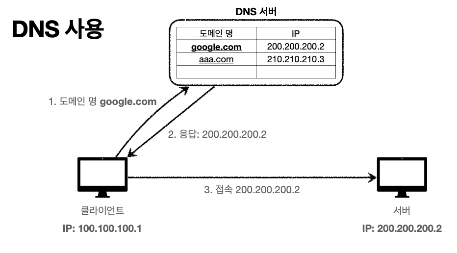

# 인터넷 네트워크 - DNS(Domain Name System)
> 강의 [모든 개발자를 위한 HTTP 웹 기본 지식](https://www.inflearn.com/course/http-%EC%9B%B9-%EB%84%A4%ED%8A%B8%EC%9B%8C%ED%81%AC/dashboard) 와 개인적으로 공부한 내용을 정리하였습니다.

## 왜 DNS(Domain Name System)?
- IP는 기억하기 어렵다.
- IP는 변경될 수 있다.

#### DNS(Domain Name System)
- 도메인 네임 시스템
  
  
알아보기
여러 DNS 시스템이 존재하니까 중복 가능성이 있음.
이때의 우선순위는 어케되니ㅡㄴ건가??
절대 중복이 불가능한건가??
