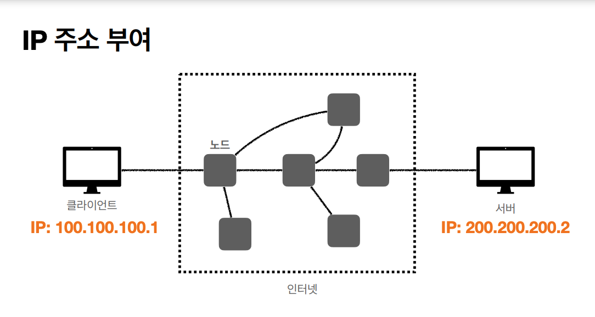

# 인터넷 네트워크 - 통신과 인터넷 프로토콜
> 강의 [모든 개발자를 위한 HTTP 웹 기본 지식](https://www.inflearn.com/course/http-%EC%9B%B9-%EB%84%A4%ED%8A%B8%EC%9B%8C%ED%81%AC/dashboard) 와 개인적으로 공부한 내용을 정리하였습니다.

웹이나 HTTP도 인터넷 네트워크 안에서 일어난다. 인터넷 망을 통해 두 컴퓨터가 통신하기 위해서 여러 노드를 거치는 데, 이 요청을 잘 전달하기 위한 방법에 IP(인터넷 프로토콜)이다.

#### IP 인터넷 프로토콜 역할
- 지정한 IP 주소(IP Address)에 데이터 전달 
- 패킷(Packet)이라는 통신 단위로 데이터 전달

#### IP 패킷 정보
- 패킷 : 수화물을 뜻하는 패키지와 덩어리라는 의미의 버킷의 합성어
- 출발지IP, 목적지IP, 기타 정보
- 전송할 데이터
- 전송 데이터가 너무 많으면 1500 바이트 정도의 단위로 끊어서 보냄

#### IP 프로토콜의 한계
1. 비연결성
    - 클라이언트는 서버가 존재하는지, 서비스 가능 상태인지 모름 (일단 요청함)
2. 비신뢰성
    - 패킷 소실 : 결국 여러 서버를 거쳐서 전달되는 것. 중간 노드가 여러가지 이유로 작동하지 않는다면 내가 전달판 패킷 소실
    - 패킷 전달 순서 문제 발생 : 1500 바이트가 넘으면 패킷 단위를 쪼개서 보내는데, 나뉜 패킷들이 모두 동일한 경로로 가지 않기 때문에 최종적으로 두번째 순서의 패킷이 먼저 도착할 수도 있음
    - 이런 문제를 해결해주는게 바로 [TCP 프로토콜](tcp-and-udp.md) 이다.
3. 프로그램 구분
    - 같은 IP를 사용하는 서버에서 통신하는 어플리케이션이 둘 이상일 경우 어떤 어플리케이션인지 구분이 어렵다.