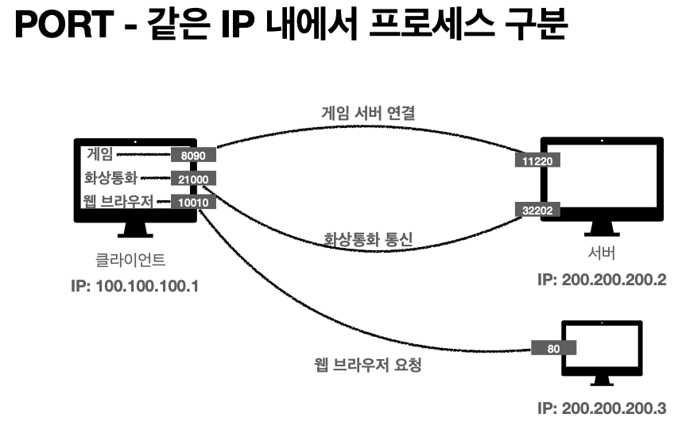

# 인터넷 네트워크 - PORT
> 강의 [모든 개발자를 위한 HTTP 웹 기본 지식](https://www.inflearn.com/course/http-%EC%9B%B9-%EB%84%A4%ED%8A%B8%EC%9B%8C%ED%81%AC/dashboard) 와 개인적으로 공부한 내용을 정리하였습니다.

#### PORT
- TCP/IP 패킷 내 출발지 Port, 목적지 Port 정보가 있음.
- 같은 IP 내에서 프로세스 구분하기 위해 사용
- 0 ~ 65535 할당 가능
- 0 ~ 1023: 잘 알려진 포트, 사용하지 않는 것이 좋음
- FTP - 20, 21 TELNET - 23 HTTP - 80 HTTPS - 443 등...