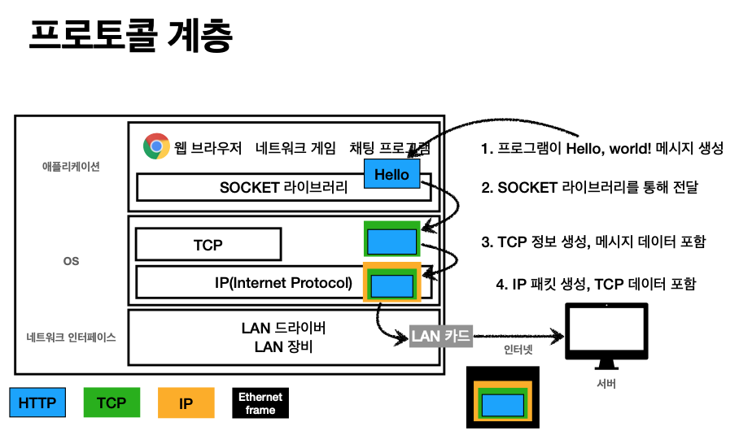
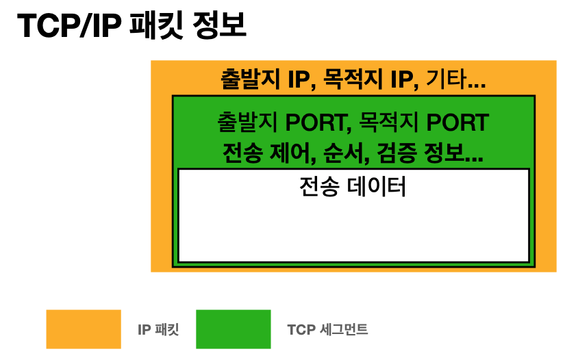
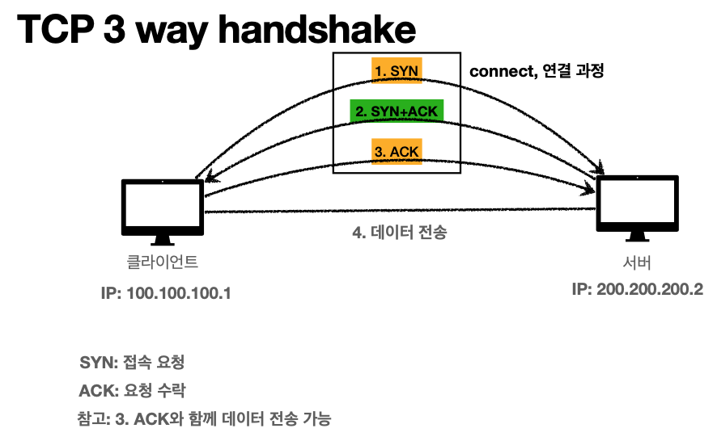

# 인터넷 네트워크 - TCP와 UDP
> 강의 [모든 개발자를 위한 HTTP 웹 기본 지식](https://www.inflearn.com/course/http-%EC%9B%B9-%EB%84%A4%ED%8A%B8%EC%9B%8C%ED%81%AC/dashboard) 와 개인적으로 공부한 내용을 정리하였습니다.

IP 프로토콜의 문제(패킷의 소실, 순서 보장 X)을 TCP를 통해 해결할 수 있다. UDP는 이런 IP 프로토콜의 문제를 해결해주지는 않지만 도움되는 게 있으니 함께 정리한다.
TCP에는 언급한 것 보다 더 많은 기능이 있지만 일단 이 정도만 정리한다.

#### 인터넷 프로토콜 스택의 4계층 인터넷 프로토콜 스택의 4계층
- 애플리케이션 계층 - HTTP, FTP
- 전송 계층 - TCP, UDP
- 인터넷 계층 - IP
- 네트워크 인터페이스 계층 - 랜 카드, 랜 드라이버 등 실제 물리적 네트워크 인터페이스도 포함

#### 프로토콜 계층

- 내가 만든 메시지(=HTTP)을 OS 계층에서 TCP 정보를 넣어서 감쌈
- IP에서 패킷으로 다시 감쌈
- 네트워크 인터페이스 계층에서 진짜 물리적 랜 카드에 등록된 맥주소 등을 포함해서 이더넷 프레임이라는 걸로 감쌈

## TCP(Transmission Control Protocol)
IP 프로토콜 위에 TCP를 얹어서 보완한 것을 `TCP/IP`라고 표현하는 듯 하다.

이제 IP 패킷 내에 TCP 세그먼트(초록)이 포함된다.
TCP 정보에는 Port와 전송제어, 순서, 검증 정보를 포함하기 때문에 IP 프로토콜에서 발생했던 문제를 해결할 수 있다.

#### TCP 특징
- 전송 제어 프로토콜(Transmission Control Protocol)
- 연결지향 - TCP 3 way handshake (가상 연결) 
    - 먼저 연결을 한 후 데이터를 전송함
    - 
    - 요즘에는 많이 최적화되서 3번 ACK를 보낼때 함께 데이터도 전송하기도 함
    - 개념적으로만 연결된거지 실제로 연결된 것은 아님. 서로 살아있음을 점검하는 거고, 응답을 서로 주고받는 걸 성공하면 논리적으로 연결됐다고 가정하는 것
- 데이터 전달 보증 
    - 패킷이 중간에 소실될 경우 클라이언트가 해당 사실을 인지할 수 있게 알려줌
    - 요청을 정상적으로 받을 경우, 응답 서버에서 클라이언트에 데이터 잘 받았다고 알려줌
- 순서 보장
    - 응답받는 곳에서 패킷이 순서대로 도착하지 않는다면, 클라이언트에 얽힌 곳부터 다시 순서대로 보내라고 요청함
    - 서버에서 내부적으로 최적화도 가능하지만, 기본적으로는 클라이언트에 재요청하는 방식으로 함
    - 이게 가능한 이유는 TCP 세그먼트 정보를 이용하기 때문임

## UDP(User Datagram Protocol)
#### UDP 특징
- 사용자 데이터그램 프로토콜
- 하얀 도화지에 비유(기능이 거의 없음) 
- 연결지향 - TCP 3 way handshake X 
- 데이터 전달 보증 X
- 순서 보장 X
- 데이터 전달 및 순서가 보장되지 않지만, 단순하고 빠름 정리
- IP와 거의 같다. +PORT +체크섬 정도만 추가 애플리케이션에서 추가 작업 필요

#### 어떨 때 사용할까?
- 원래는 영상같은 데이터를 통신할 때 사용했는데, 요즘에는 영상조차 TCP/IP로 통신함(TCP 점유율 90%이상)
- TCP 계층은 이미 네트워크 표준이라 더 이상 최적화 불가. 하지만 UDP를 직접 어플리케이션 레벨에서 무언가 만들어내면 된다. 
- 최근에 HTTP 3 통신할 때 더 최적화하고 비용을 줄이기 위해 UDP 프로토콜을 채택하게 되면서 각광을 받게 됨. 
