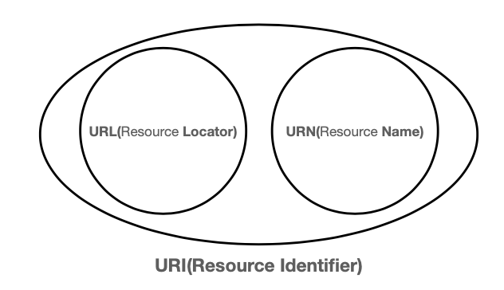
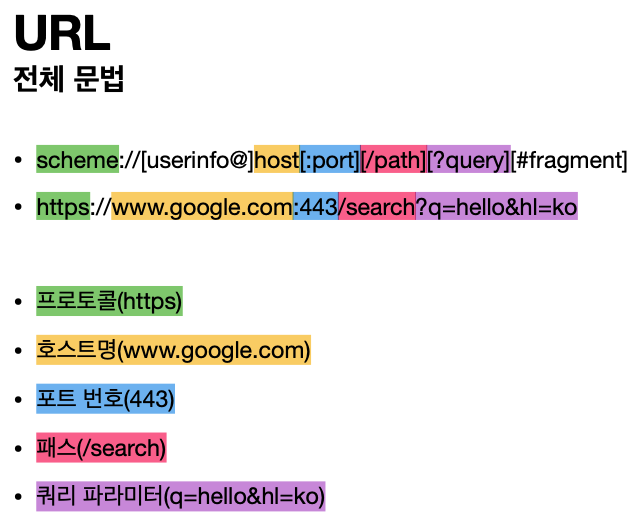

# URI
> 강의 [모든 개발자를 위한 HTTP 웹 기본 지식](https://www.inflearn.com/course/http-%EC%9B%B9-%EB%84%A4%ED%8A%B8%EC%9B%8C%ED%81%AC/dashboard) 와 개인적으로 공부한 내용을 정리하였습니다.

- URI는 로케이터(locator), 이름(name) 또는 둘 다 추가로 분류될 수 있다
- [1.1.3. URI, URL, and URN](https://www.ietf.org/rfc/rfc3986.txt)

## URI(Uniform Resource Identifier)
- Uniform: 리소스 식별하는 통일된 방식
- Resource: 자원, URI로 식별할 수 있는 모든 것(제한 없음)
- Identifier: 다른 항목과 구분하는데 필요한 정보

#### URL과 URN
- URL - Locator : 리소스가 있는 위치를 지정
- URN - Name : 리소스에 이름을 부여
- 위치는 변할 수 있지만, 이름은 변하지 않음
- URN 이름만으로 실제 리소스를 찾을 수 있는 방법이 보편화 되지 않음
- urn:isbn:8960777331 (어떤 책의 isbn URN)
- **앞으로 URI를 URL과 같은 의미로 이야기하겠음**

## URL 전체 문법
 

#### URL Scheme
- 주로 프로토콜 사용
- 프로토콜: 어떤 방식으로 자원에 접근할 것인가 하는 약속 규칙
    - 예) http, https, ftp 등등
- http는 80 포트, https는 443 포트를 주로 사용, 포트는 생략 가능
- https는 http에 보안 추가 (HTTP Secure)

#### URL userinfo
- URL에 사용자정보를 포함해서 인증 
- 거의 사용하지 않음

#### URL host
- 호스트명
- 도메인명 또는 IP 주소를 직접 사용가능

#### URL PORT
- 포트(PORT)
- 접속 포트
- 일반적으로 생략, 생략시 http는 80, https는 443

#### URL path
- 리소스 경로(path), 계층적 구조 
- 예)
    - /home/file1.jpg
    - /members
    - /members/100, /items/iphone12
#### URL query
- key=value 형태
- ?로 시작, &로 추가 가능 ?keyA=valueA&keyB=valueB
- query parameter, query string 등으로 불림, 웹서버에 제공하는 파라미터, 문자 형태
#### URL fragment
- `scheme://[userinfo@]host[:port][/path][?query][#fragment]`
- `https://docs.spring.io/spring-boot/docs/current/reference/html/getting-started.html#getting-started-introducing-spring-boot`
- 위 URL에서 `#getting-started-introducing-spring-boot` 부분이 fragment임
- html 내부 북마크 등에 사용
- 서버에 전송하는 정보 아님