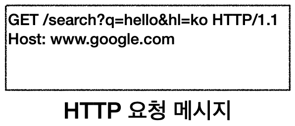
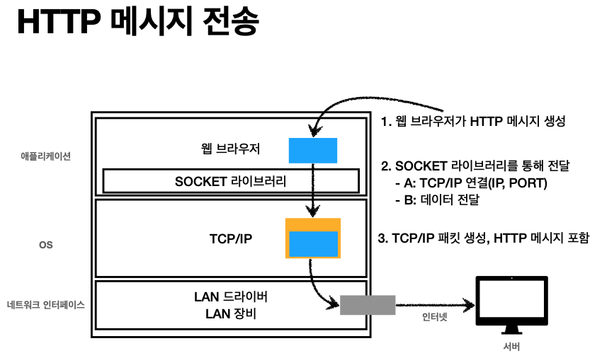
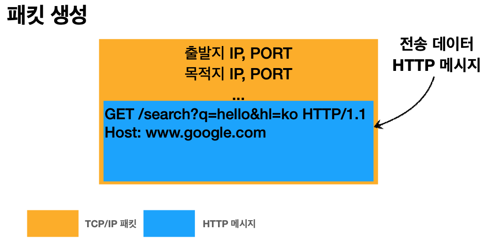
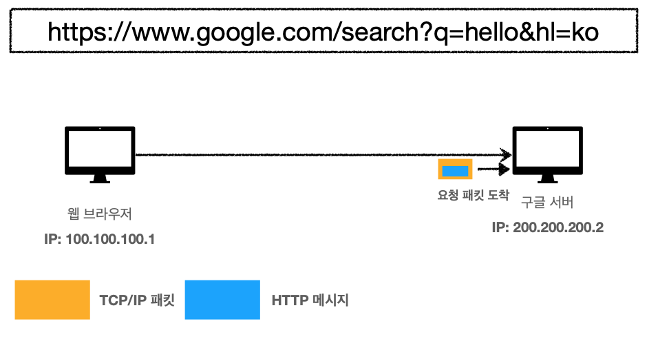
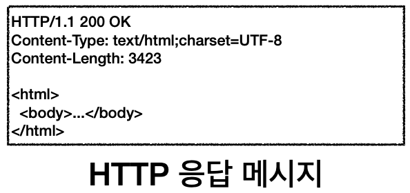
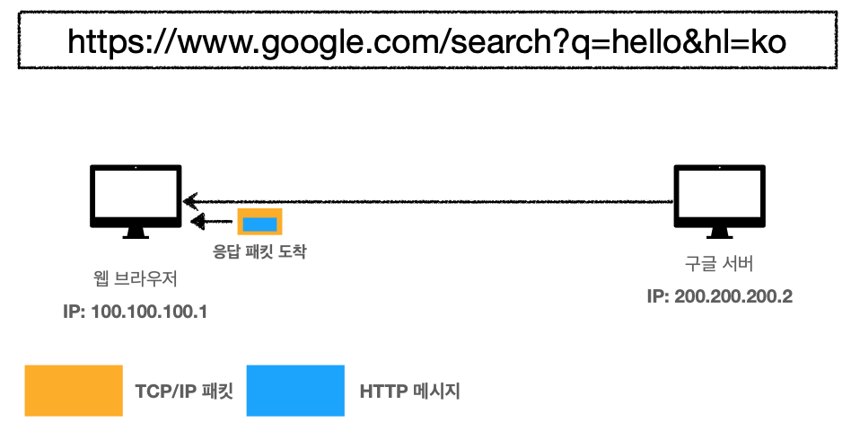

# 웹 브라우저 요청 흐름
> 강의 [모든 개발자를 위한 HTTP 웹 기본 지식](https://www.inflearn.com/course/http-%EC%9B%B9-%EB%84%A4%ED%8A%B8%EC%9B%8C%ED%81%AC/dashboard) 와 개인적으로 공부한 내용을 정리하였습니다.

1. 웹 브라우저에서 요청 
    ```
    https://www.google.com/search?q=hello&hl=ko
    ```
2. 요청에 대한 HTTP 메시지 생성
    

3. TCP/IP 패킷 생성 및 HTTP 메시지 전송 
    - 
    - 
    - 
4. 서버의 응답 메시지 생성
    
5. 서버의 응답 메시지 반환
    
    