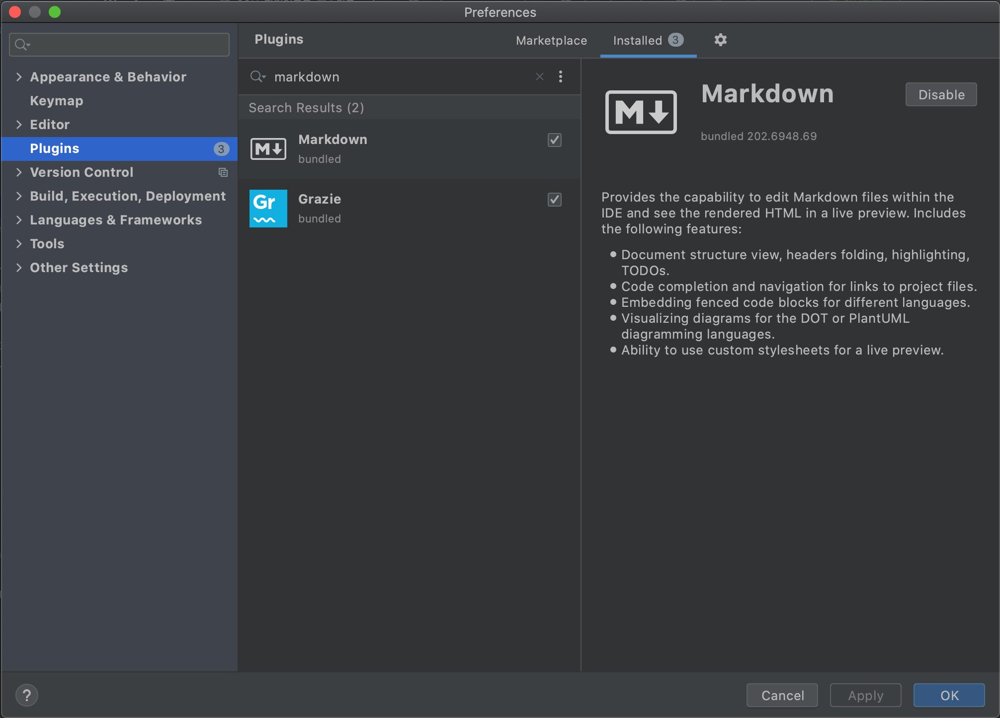

# Intellij에서 마크다운 preview가 보이지 않을 때
종종 인텔리제이에서 부분적으로 markdown 미리보기가 되지 않는 현상이 있다. 모두 그런 게 아니라 부분부분 특정 파일만 그런데 원인은 모르겠다.

간단하게 시도해볼 수 있는 방법으로는 `Markdown plugin`을 재시작하는 것이다.

1. Preference 메뉴 (`command`+`,`)
2. plugin에서 `Markdown` 검색
3. disable
4. enable
5. IntelliJ restart

Intellij Support : [Mardown plugin doesn't show preview](https://intellij-support.jetbrains.com/hc/en-us/community/posts/360003498520-Mardown-plugin-doesn-t-show-preview)