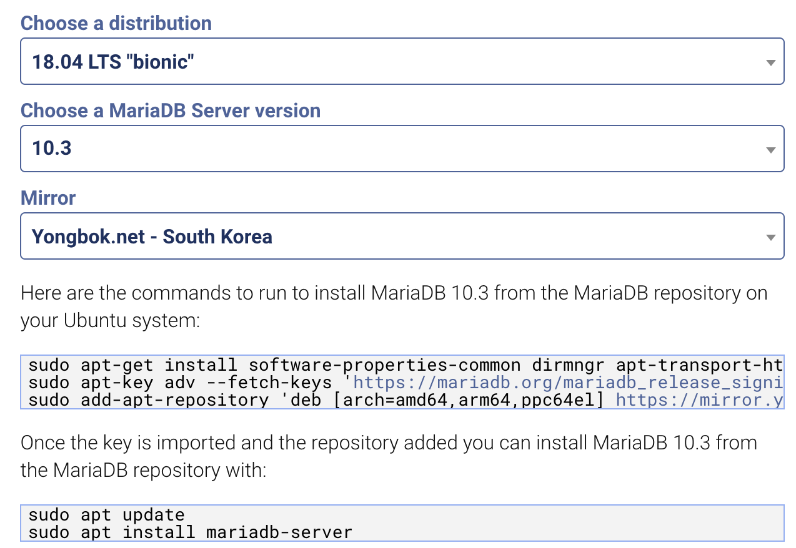

# Linux(Ubuntu 18.04 LTS)에 MariaDB 특정 버전 설치
매번 공식문서랑 다른 문서 뒤적거리면서 설치하는 게 번거롭다.

1. 기존 mariadb or mysql 제거
   ```
   $ sudo apt-get purge mysql-server mysql-client mysql-common mysql-server-core-* mysql-client-core-*
   ```
   위 명령어 수행 시 시 /etc/mysql, /var/lib/mysql 폴더도 함께 삭제된다.
   혹시 삭제가 되지 않았을 경우 `sudo rm -f /etc/mysql /var/lib/mysql` 명령어 수행

   ```
   $ sudo apt-get autoremove
   $ sudo apt-get autoclean
   ```
   
2. [MariaDB Repositories 다운로드](https://mariadb.org/download/#mariadb-repositories)
   - OS 선택 : Ubuntu 18.04 LTS "bionic"
   - MariaDB Server version : 10.3
   ```
   sudo apt-get install software-properties-common dirmngr apt-transport-https
   sudo apt-key adv --fetch-keys 'https://mariadb.org/mariadb_release_signing_key.asc'
   sudo add-apt-repository 'deb [arch=amd64,arm64,ppc64el] https://mirror.yongbok.net/mariadb/repo/10.3/ubuntu bionic main'
   ```
   
3. MariaDB 설치
   ```
   sudo apt update
   sudo apt install mariadb-server
   ```

4. MariaDB 로그인
   ```
   $ mysql -u root(혹은 사용자명) -p
   ```
   root 계정에 대한 비밀번호 입력을 요구함

5. 데이터베이스 생성
   ```
   MariaDB [(none)]> create database 디비명;
   ```
4. 사용자 생성
   ```
   MariaDB [(none)]> CREATE USER '아이디'@'localhost' IDENTIFIED WITH mysql_native_password; 
   ```
5. 비밀번호 설정
   - [MariaDB 10.4 이후 비밀번호 인증방식 변화](https://wnw1005.tistory.com/443?category=823629) (10.3 버전 설치했지만 참고)
   ```
    MariaDB [(none)]> select password('비밀번호');
    +-------------------------------------------+
    | password('비밀번호')                        |
    +-------------------------------------------+
    | *A9BFCD08A9B6CE650A72EFBCB38C8618293EF2B1 |
    +-------------------------------------------+
    1 row in set (0.000 sec)

    MariaDB [(none)]> update mysql.user set password= '*A9BFCD08A9B6CE650A72EFBCB38C8618293EF2B1' where user = '아이디';
    Query OK, 1 row affected (0.000 sec)
   
   ```
6. 권한 부여
   ```
    MariaDB [(none)]> GRANT ALL PRIVILEGES ON *.* to '아이디'@'localhost' IDENTIFIED BY '비밀번호';
    Query OK, 0 rows affected (0.000 sec)
    
    MariaDB [(none)]> FLUSH PRIVILEGES;
    Query OK, 0 rows affected (0.000 sec)
   ```